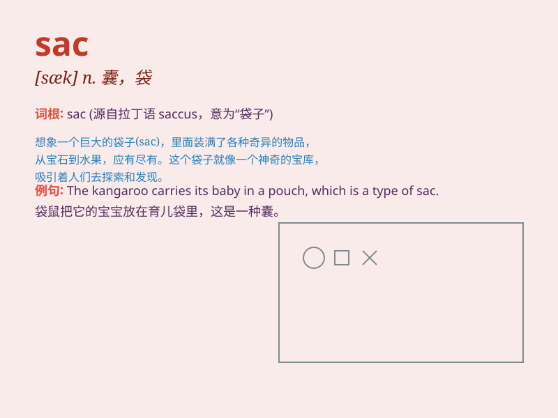

## sac

**英音:** _[sæk]_ **美音:** _[sæk]_

**译义:** *n. \<生>囊,液囊n. &adj. =Sauk*

### 短语

+ **sac fungus:** _子囊菌_

+ **yolk sac:** _卵黄囊_

+ **air sac:** _气囊_

+ **sac spider:** _袋蛛_

+ **sac wing:** _翅囊_

### 例句

#### 例句1

> **The sac containing the embryo is very fragile.**

**中文翻译:** 包含胚胎的囊非常脆弱。

**单词释义:** 囊；液囊

#### 例句2

> **The spider has a sac of venom in its fangs.**

**中文翻译:** 蜘蛛的毒牙里有一囊毒液。

**单词释义:** 囊；液囊

#### 例句3

> **The mother bird guards the sac of her eggs.**

**中文翻译:** 鸟妈妈守护着她的一窝蛋。

**单词释义:** 一窝；一囊

### 背诵小故事

> A brave knight found a mysterious SAC in a cave. It was filled with
magical potions. But he knew it was a sac of great power and needed to
be used wisely.

**一位勇敢的骑士在一个洞穴里发现了一个神秘的囊。里面装满了神奇的药水。但他知道这是一个充满巨大力量的囊，需要明智地使用。**

### 图义

