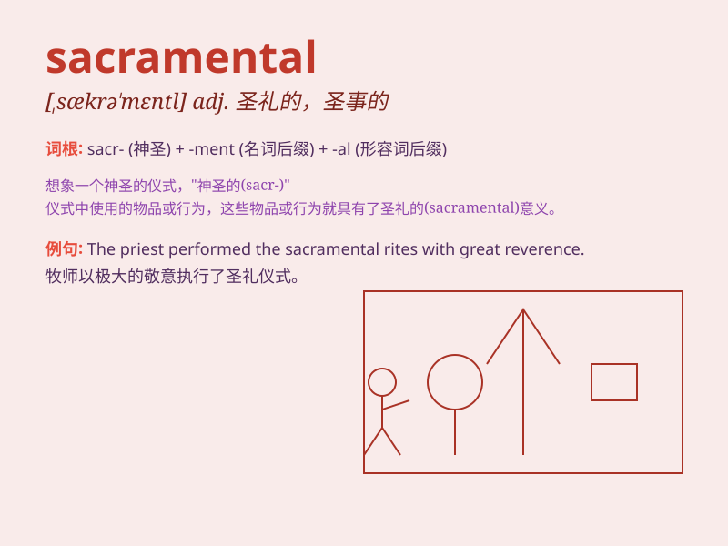

## sacramental

**英音:** _[sækrə\'ment(ə)l]_ **美音:**
_[,sækrə\'mɛntl]_

**译义:** *n.天主教之类似圣典礼仪或事物adj.圣礼的,圣典的*

### 短语

+ **sacramental wine:** _圣餐酒_

+ **sacramental grace:** _圣事恩宠_

+ **sacramental bread:** _圣餐面包_

+ **sacramental character:** _圣事性特征_

+ **sacramental theology:** _圣事神学_

### 例句

#### 例句1

> **The priest administered the sacramental bread and wine.**

**中文翻译:** 牧师分发了圣餐中的面包和酒。

**单词释义:** 与圣礼有关的

#### 例句2

> **The sacramental ceremony was held in the church with great
solemnity.**

**中文翻译:** 圣礼仪式在教堂里庄严举行。

**单词释义:** 圣礼的

#### 例句3

> **She wore a sacramental dress on the special occasion.**

**中文翻译:** 在这个特殊的场合，她穿着一件用于圣礼的礼服。

**单词释义:** 用于宗教仪式的

### 背诵小故事

> A priest was performing a sacred ritual. The items used in the ritual
were called sacramental. They held special spiritual power and
significance. Remember, sacramental means related to sacred religious
ceremonies.

**一位牧师正在举行一场神圣的仪式。仪式中使用的物品被称为圣事用品。它们具有特殊的精神力量和意义。记住，sacramental
意思是与神圣的宗教仪式有关的。**

### 图义

