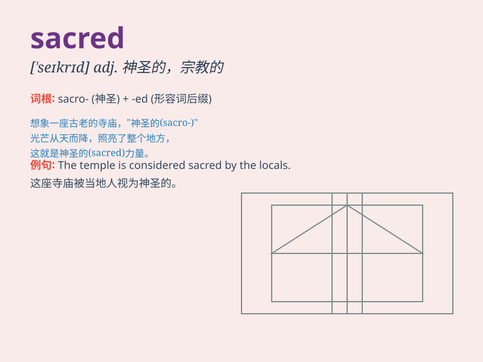

## sacred

**英音:** _[\'seɪkrɪd]_ **美音:** _[\'sekrɪd]_

**译义:** *adj.神的,宗教的,庄严的,神圣的*

### 短语

+ **sacred cow:** _神圣不可侵犯的事物；不容批评的人（或事物）_

+ **sacred place:** _圣地_

+ **sacred duty:** _神圣职责_

+ **sacred music:** _宗教音乐_

+ **sacred tree:** _神树_

### 例句

#### 例句1

> **The ancient temple is considered a sacred place.**

**中文翻译:** 这座古老的寺庙被认为是一个神圣的地方。

**单词释义:** 神圣的

#### 例句2

> **The sacred book holds great significance for the believers.**

**中文翻译:** 这本圣书对信徒们意义重大。

**单词释义:** 神圣的

#### 例句3

> **Respecting sacred traditions is important in this community.**

**中文翻译:** 在这个社区，尊重神圣的传统很重要。

**单词释义:** 神圣的

### 背诵小故事

> A long time ago, in a faraway village, there was a special tree.
Everyone believed it had magical powers and was protected. This tree was
considered sacred. It was a place where people found peace and hope.

**很久以前，在一个遥远的村庄，有一棵特别的树。每个人都相信它有神奇的力量并受到保护。这棵树被认为是神圣的。它是人们找到和平与希望的地方。**

### 图义

