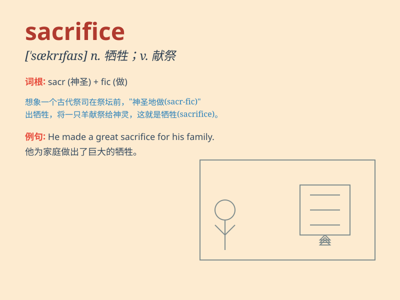

## sacrifice

**英音:** _[\'sækrɪfaɪs]_ **美音:** _[\'sækrɪfaɪs]_

**译义:** *n.牺牲,献身,祭品,供奉v.牺牲,献出,献祭,供奉*

### 短语

+ **make a sacrifice:** _做出牺牲_

+ **sacrifice oneself:** _自我牺牲_

+ **sacrifice for:** _为\...\...牺牲_

+ **human sacrifice:** _人祭；活人献祭_

+ **animal sacrifice:** _动物献祭_

### 例句

#### 例句1

> **She made the sacrifice of giving up her career to look after her
sick mother.**

**中文翻译:** 她做出了牺牲，放弃了自己的事业来照顾生病的母亲。

**单词释义:** 牺牲

#### 例句2

> **The soldiers made the ultimate sacrifice for their country.**

**中文翻译:** 士兵们为了他们的国家做出了最后的牺牲。

**单词释义:** 牺牲

#### 例句3

> **He was willing to sacrifice his own interests for the sake of the
team.**

**中文翻译:** 为了团队，他愿意牺牲自己的利益。

**单词释义:** 牺牲

### 背诵小故事

> A brave knight was willing to sacrifice his life to protect the
kingdom. He fought against the evil dragon without hesitation. His
sacrifice made the people remember him forever.

**一位勇敢的骑士愿意牺牲自己的生命来保护王国。他毫不犹豫地与恶龙战斗。他的牺牲让人们永远铭记他。**

### 图义

