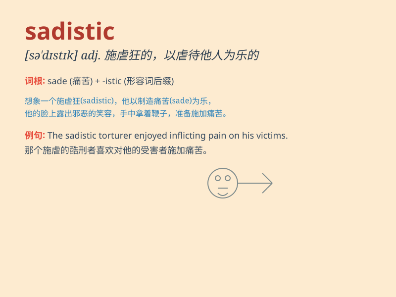

## sadistic

**英音:** _[sə\'dɪstɪk]_ **美音:** _[səˈdɪstɪk]_

**译义:** *adj.[心]虐待狂的,残酷成性的*

### 短语

+ **sadistic pleasure:** _施虐的快感_

+ **sadistic behavior:** _施虐行为_

+ **sadistic tendencies:** _施虐倾向_

+ **sadistic torture:** _施虐性的折磨_

+ **sadistic personality:** _施虐型人格_

### 例句

#### 例句1

> **The sadistic guard took pleasure in tormenting the prisoners.**

**中文翻译:** 那个有施虐癖的警卫以折磨囚犯为乐。

**单词释义:** 有施虐癖的

#### 例句2

> **His sadistic behavior towards animals was unacceptable.**

**中文翻译:** 他对动物的施虐行为是不可接受的。

**单词释义:** 施虐的

#### 例句3

> **The villain in the movie had a sadistic streak, enjoying the pain
of others.**

**中文翻译:** 电影中的反派有施虐的倾向，喜欢他人的痛苦。

**单词释义:** 施虐狂的

### 背诵小故事

> A detective was chasing a criminal. The criminal showed a sadistic
smile when he hurt an innocent person. The detective knew this sadistic
behavior was very evil.

**一位侦探正在追捕一名罪犯。罪犯在伤害一个无辜的人时露出了施虐狂般的笑容。侦探知道这种施虐的行为非常邪恶。**

### 图义

