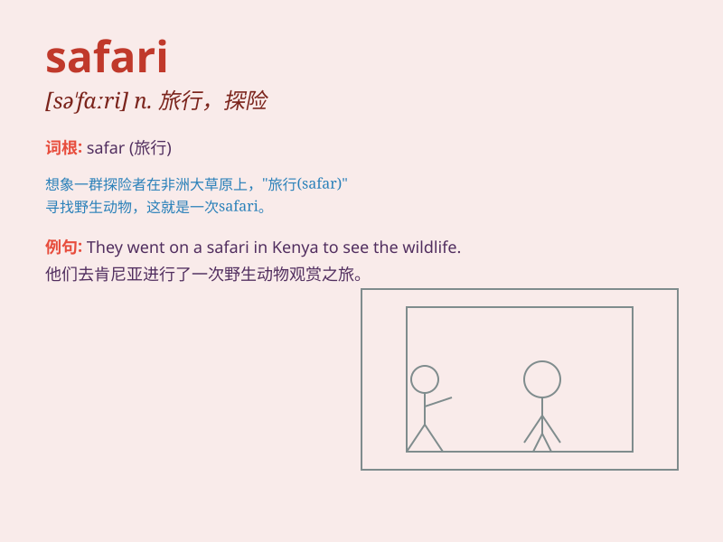

## safari

**英音:** _[sə\'fɑːrɪ]_ **美音:** _[sə\'fɑri]_

**译义:** *n.旅行,狩猎远征,旅行队,旅行队(狩猎远征队)及装备*

### 短语

+ **safari park:** _野生动物园_

+ **safari jacket:** _狩猎夹克_

+ **safari suit:** _狩猎装_

+ **safari holiday:** _狩猎度假_

+ **safari guide:** _狩猎向导_

### 例句

#### 例句1

> **We went on a safari in Kenya and saw many wild animals.**

**中文翻译:** 我们在肯尼亚进行了一次狩猎旅行，看到了许多野生动物。

**单词释义:** 狩猎旅行；长途旅行

#### 例句2

> **The safari park is a great place to observe different
species.**

**中文翻译:** 野生动物园是观察不同物种的好地方。

**单词释义:** 野生动物园

#### 例句3

> **She wore a safari jacket for the adventure.**

**中文翻译:** 她为这次冒险穿了一件狩猎夹克。

**单词释义:** 狩猎夹克（一种服装款式）

### 背诵小故事

> A group of friends went on a safari. They saw many wild animals like
lions and giraffes. It was an exciting adventure. They took pictures and
had a great time in the natural world.

**一群朋友去了一次游猎。他们看到了很多野生动物，比如狮子和长颈鹿。这是一次令人兴奋的冒险。他们拍照留念，在自然世界里度过了美好时光。**

### 图义

