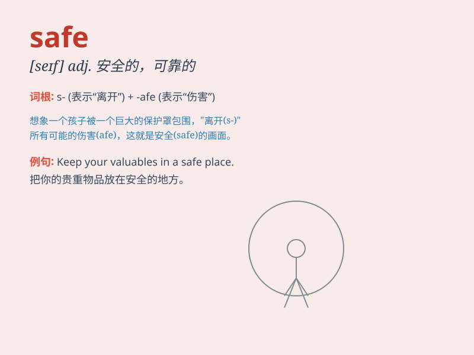

## safe

**英音:** _[seɪf]_ **美音:** _[sef]_

**译义:**
*n.保险箱,饭橱,菜橱,冷藏室adj.免受攻击的,安全的,可靠的,有把握的*

### 短语

+ **safe haven:** _安全港；避风港_

+ **safe deposit box:** _保险箱_

+ **safe and sound:** _安然无恙_

+ **play it safe:** _谨慎行事；不冒险_

+ **safe passage:** _安全通道；安全通行_

### 例句

#### 例句1

> **The children are playing in a safe place.**

**中文翻译:** 孩子们正在一个安全的地方玩耍。

**单词释义:** 安全的

#### 例句2

> **It\'s not safe to walk alone at night.**

**中文翻译:** 晚上独自走路不安全。

**单词释义:** 安全的；无危险的

#### 例句3

> **Keep your money in a safe.**

**中文翻译:** 把你的钱放在保险箱里。

**单词释义:** 保险箱

### 背诵小故事

> One day, a little boy was lost in a big city. He was very scared. But
finally, he found a safe place - a police station. The police helped him
and he felt safe and happy.

**有一天，一个小男孩在大城市里迷路了。他非常害怕。但最后，他找到了一个安全的地方------警察局。警察帮助了他，他感到安全又开心。**

### 图义

