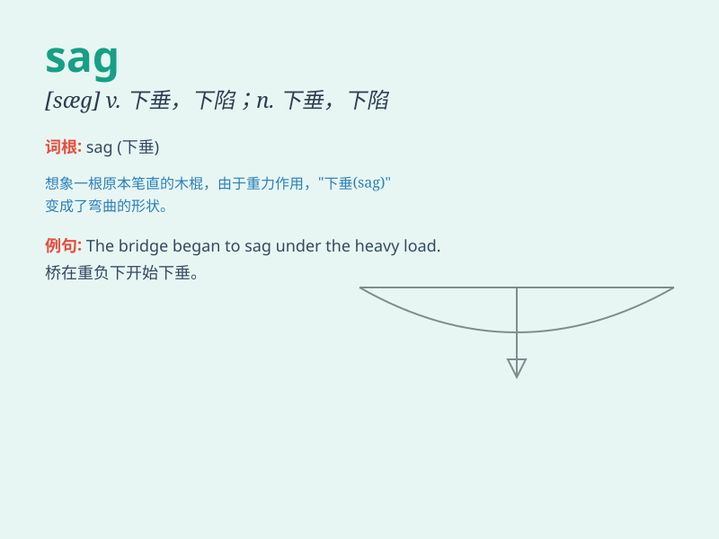

## sag

**英音:** _[sæg]_ **美音:** _[sɑɡ]_

**译义:**
*v.松弛,下陷,下垂,(物价)下跌,漂流n.下垂,下陷,物价下跌,随风漂流,垂度*

### 短语

+ **sag down:** _下陷；下沉_

+ **sag under:** _在\...下弯曲；在\...下下陷_

+ **sag slightly:** _轻微下陷_

+ **sag inward:** _向内凹陷_

+ **sag gradually:** _逐渐下陷_

### 例句

#### 例句1

> **The rope sagged under the weight of the load.**

**中文翻译:** 绳子在重物的压力下下垂了。

**单词释义:** 下垂；下陷

#### 例句2

> **His spirits sagged when he heard the bad news.**

**中文翻译:** 当他听到这个坏消息时，他的精神萎靡了。

**单词释义:** 萎靡；消沉

#### 例句3

> **The middle of the bridge sagged dangerously.**

**中文翻译:** 桥的中部危险地下陷了。

**单词释义:** 下陷；下沉

### 背诵小故事

>
想象一下，有一根绳子悬挂着重物，时间久了，绳子中间就会向下弯曲，这就是\'sag\'。就像老旧的沙发，坐久了中间就会
sag 下去，变得不再平整。

**想象一根悬挂重物的绳子因重力而弯曲，或老旧沙发中间下陷的情景来辅助记忆\'sag\'（下陷；下垂；
sag 作动词有（中间）下陷、（身体某部位）下垂等意思）**

### 图义

