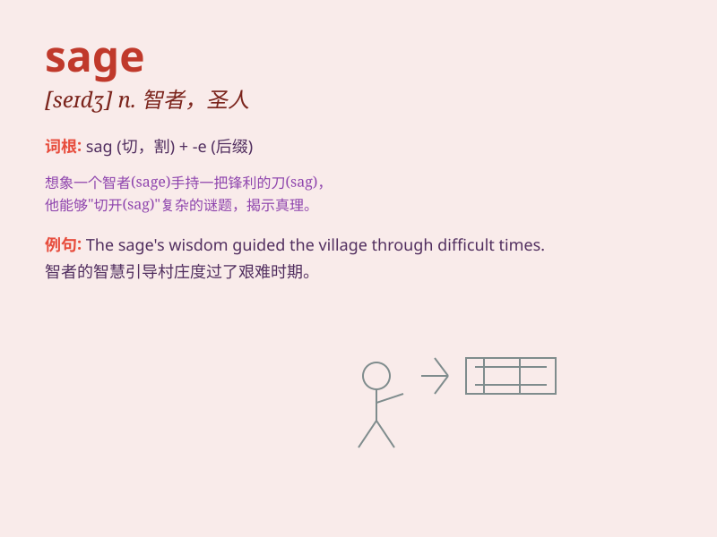

## sage

**英音:** _[seɪdʒ]_ **美音:** _[sedʒ]_

**译义:** *adj.贤明的,明智的,审慎的n.贤人,圣人,年高望重的人*

### 短语

+ **wise sage:** _睿智的圣人_

+ **sage advice:** _明智的建议_

+ **sage green:** _鼠尾草绿_

+ **herbal sage:** _草药鼠尾草_

+ **sagebrush country:** _鼠尾草地区_

### 例句

#### 例句1

> **The sage offered wise advice to the young couple.**

**中文翻译:** 这位智者给这对年轻夫妇提供了明智的建议。

**单词释义:** 智者；贤人

#### 例句2

> **She always remained calm and sage in difficult situations.**

**中文翻译:** 在困难的情况下，她总是保持冷静和睿智。

**单词释义:** 睿智的；明智的

#### 例句3

> **The old sage\'s teachings have been passed down through
generations.**

**中文翻译:** 这位老贤人的教诲代代相传。

**单词释义:** 圣人；贤哲

### 背诵小故事

> 从前有个智者，他的智慧如同古老的 sage
树一样深厚。人们遇到难题总会找他，因为他总能给出明智的建议。他的思考深邃，判断准确，就像
sage 这个词所代表的睿智的人。

**从前有个充满智慧的人，他像 sage
这个词所表示的圣人、智者一样，能为人们解决难题，给出明智建议，展现出深刻的思考和准确的判断。**

### 图义

