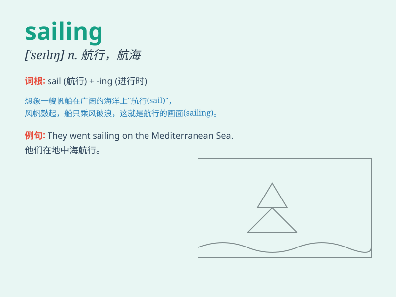

## sailing

**英音:** _[\'seɪlɪŋ]_ **美音:** _[\'selɪŋ]_

**译义:** *v.航行adj.航行的*

### 短语

+ **sailing boat:** _帆船_

+ **sailing date:** _启航日期_

+ **sailing schedule:** _航行时间表_

+ **smooth sailing:** _一帆风顺；进展顺利_

+ **sailing trip:** _航海旅行_

### 例句

#### 例句1

> **The sailing trip was very enjoyable.**

**中文翻译:** 这次帆船旅行非常愉快。

**单词释义:** 帆船运动；航行

#### 例句2

> **She has a passion for sailing.**

**中文翻译:** 她热衷于帆船运动。

**单词释义:** 帆船运动

#### 例句3

> **The ship is ready for sailing.**

**中文翻译:** 这艘船准备好出航了。

**单词释义:** 航行

### 背诵小故事

> One sunny day, Tom decided to go sailing. He hoisted the sails, felt
the wind in his face, and enjoyed the peaceful journey on the sea. The
boat moved smoothly, and Tom had a wonderful time sailing.

**在一个阳光明媚的日子，汤姆决定去航海。他升起了船帆，感受着风吹拂脸庞，享受着在海上的平静旅程。船平稳地移动，汤姆度过了一段美妙的航海时光。**

### 图义

