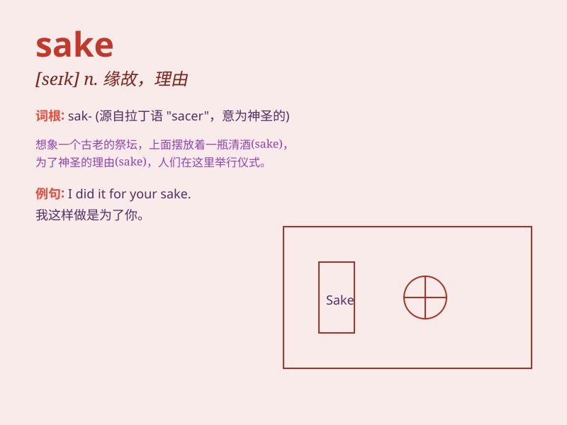

## sake

**英音:** _[seɪk]_ **美音:** _[sek]_

**译义:** *n.为了\...之好处,出于对\...的兴趣,缘故,理由,日本米酒*

### 短语

+ **for the sake of:** _为了；因为；由于_

+ **without sake:** _无缘无故；毫无理由_

+ **for goodness\' sake:** _看在上帝的份上；求求你_

+ **for old times\' sake:** _看在旧日情分上；念及老交情_

+ **for safety\'s sake:** _为了安全起见_

### 例句

#### 例句1

> **For the sake of your health, you should stop smoking.**

**中文翻译:** 为了你的健康，你应该戒烟。

**单词释义:** 为了；由于

#### 例句2

> **He moved to the countryside for the sake of peace and quiet.**

**中文翻译:** 他为了寻求平静搬到了乡下。

**单词释义:** 为了；由于

#### 例句3

> **I hope you\'ll forgive me for the sake of our old friendship.**

**中文翻译:** 看在我们老交情的份上，我希望你能原谅我。

**单词释义:** 看在\...\...的份上

### 背诵小故事

> A brave knight fought in many battles for the sake of protecting his
kingdom and its people. He never gave up, knowing his efforts were for a
noble cause. The word \'sake\' here means purpose or reason.

**一位勇敢的骑士参加了许多战斗，是为了保护他的王国和人民。他从不放弃，因为知道自己的努力是为了一个崇高的目标。这里"sake"这个词的意思是目的或原因。**

### 图义

