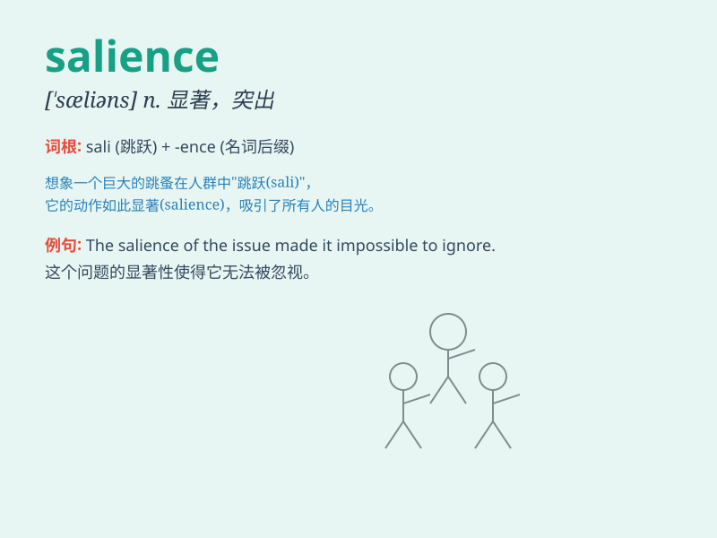

## salience

**英音:** _[\'seɪljəns]_ **美音:** _[\'selɪəns]_

**译义:** *n.显著,卓越,明显,突出,突起*

### 短语

+ **salience of an issue:** _一个问题的显著程度_

+ **perceptual salience:** _感知的显著度_

+ **cognitive salience:** _认知的显著度_

+ **salience effect:** _显著效应_

+ **emotional salience:** _情感的显著度_

### 例句

#### 例句1

> **The salience of environmental issues has increased in recent
years.**

**中文翻译:** 近年来，环境问题的显著程度有所增加。

**单词释义:** 显著；突出

#### 例句2

> **Her beauty gave her a salience in the crowd.**

**中文翻译:** 她的美丽使她在人群中很突出。

**单词释义:** 突出；引人注目

#### 例句3

> **The salience of this new policy is its potential to create
jobs.**

**中文翻译:** 这项新政策的显著之处在于它创造就业机会的潜力。

**单词释义:** 显著；重要性

### 背诵小故事

> A detective was investigating a crime. The salience of a footprint at
the scene caught his attention. It stood out clearly and led him to an
important clue. The distinctness of that footprint was the salience.

**一位侦探在调查一起犯罪案件。现场一个脚印的显著特征引起了他的注意。它清晰地凸显出来，为他提供了重要线索。那个脚印的明显之处就是'salience'（显著、突出）。**

### 图义

