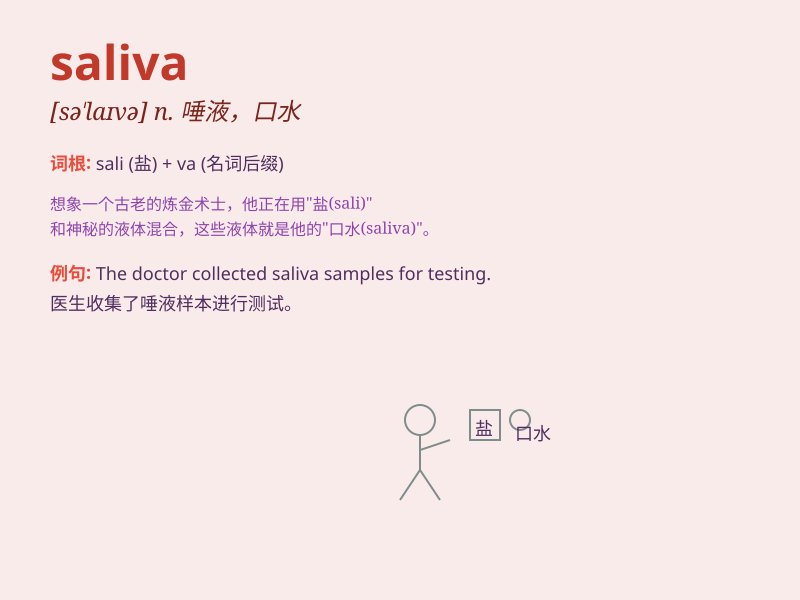

## saliva

**英音:** _[sə\'laɪvə]_ **美音:** _[sə\'laɪvə]_

**译义:** *n.口水,唾液*

### 短语

+ **saliva sample:** _唾液样本_

+ **saliva test:** _唾液检测_

+ **excessive saliva:** _唾液过多_

+ **saliva secretion:** _唾液分泌_

+ **collect saliva:** _收集唾液_

### 例句

#### 例句1

> **The doctor examined the patient\'s saliva for signs of
infection.**

**中文翻译:** 医生检查了病人的唾液以寻找感染的迹象。

**单词释义:** 唾液

#### 例句2

> **When she yawned, saliva dribbled from the corner of her
mouth.**

**中文翻译:** 她打哈欠时，唾液从嘴角流了出来。

**单词释义:** 唾液

#### 例句3

> **The dog\'s saliva dripped onto the floor as it waited for its
treat.**

**中文翻译:** 狗在等待食物时，唾液滴到了地板上。

**单词释义:** 唾液

### 背诵小故事

> One day, Tom was eating a very spicy meal. His mouth produced a lot
of liquid to cool down the heat. This liquid was called saliva. It
helped him deal with the spicy taste.

**有一天，汤姆正在吃非常辣的一餐。他的嘴里产生了很多液体来缓解辣味。这种液体被称为唾液。它帮助他应对辣味。**

### 图义

