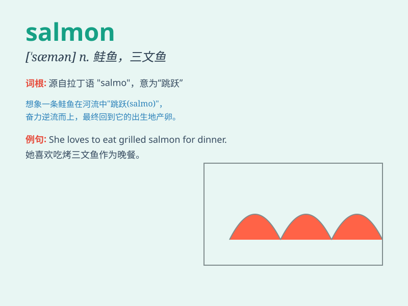

## salmon

**英音:** _[\'sæmən]_ **美音:** _[\'sæmən]_

**译义:** *n.[鱼]鲑鱼,大麻哈鱼,鲜肉色*

### 短语

+ **salmon pink:** _橙红色；浅橙色_

+ **salmon steak:** _三文鱼排_

+ **salmon fishing:** _捕鲑鱼_

+ **smoked salmon:** _熏三文鱼_

+ **fresh salmon:** _新鲜的三文鱼_

### 例句

#### 例句1

> **I had a delicious piece of grilled salmon for dinner.**

**中文翻译:** 我晚餐吃了一块美味的烤三文鱼。

**单词释义:** 三文鱼

#### 例句2

> **The river is full of wild salmon.**

**中文翻译:** 这条河里满是野生三文鱼。

**单词释义:** 三文鱼

#### 例句3

> **The color of the salmon is quite attractive.**

**中文翻译:** 三文鱼的颜色相当吸引人。

**单词释义:** 三文鱼

### 背诵小故事

> A little fish named Sam wanted to be special. So, it swam hard and
turned into a beautiful salmon. It had shiny scales and was loved by
all. Remember, Sam the fish became a salmon!

**一条叫山姆的小鱼想变得特别。于是，它努力地游，变成了一条漂亮的鲑鱼。它有着闪亮的鳞片，受到了大家的喜爱。记住，小鱼山姆变成了鲑鱼！**

### 图义

