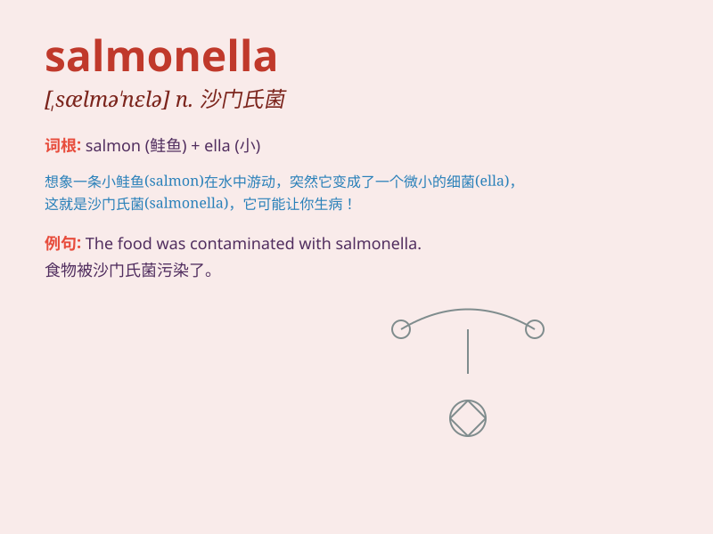

## salmonella

**英音:** _[,sælmə\'nelə]_ **美音:** _[\'sælmə\'nɛlə]_

**译义:** *n.沙门氏菌*

### 短语

+ **salmonella poisoning:** _沙门氏菌中毒_

+ **salmonella outbreak:** _沙门氏菌爆发_

+ **salmonella infection:** _沙门氏菌感染_

+ **salmonella bacteria:** _沙门氏菌_

+ **salmonella carrier:** _沙门氏菌携带者_

### 例句

#### 例句1

> **The outbreak of salmonella was traced to contaminated food.**

**中文翻译:** 沙门氏菌的爆发被追踪到受污染的食物。

**单词释义:** 沙门氏菌

#### 例句2

> **Tests revealed the presence of salmonella in the water
supply.**

**中文翻译:** 测试显示供水中存在沙门氏菌。

**单词释义:** 沙门氏菌

#### 例句3

> **She fell ill due to salmonella poisoning.**

**中文翻译:** 她因沙门氏菌中毒病倒了。

**单词释义:** 沙门氏菌

### 背诵小故事

> 想象一下，在一个热闹的海鲜市场，有一群调皮的小鱼叫
Salmon（三文鱼），它们不小心感染了一种叫 Ella 的细菌，于是就有了
salmonella（沙门氏菌）。

**想象在海鲜市场，三文鱼感染了叫 Ella 的细菌，形成了沙门氏菌的故事**

### 图义

