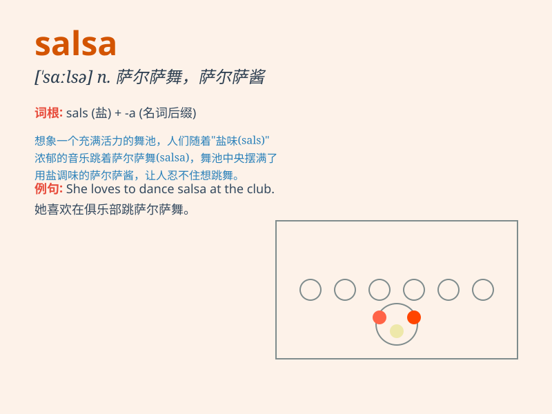

## salsa

**英音:** _[ˈsɑːlsə]_ **美音:** _[ˈsælsə]_

**译义:**
*n.萨尔萨舞；萨尔萨酱；一种流行于拉丁美洲的舞蹈和音乐形式；(一种由番茄、辣椒等制成的)调味酱*

### 短语

+ **salsa dancing:** _萨尔萨舞_

+ **hot salsa:** _辣沙司_

+ **salsa verde:** _绿沙司_

+ **fruit salsa:** _水果沙司_

+ **tomato salsa:** _番茄沙司_

### 例句

#### 例句1

> **I love to dance to the rhythm of salsa music.**

**中文翻译:** 我喜欢随着萨尔萨舞曲的节奏跳舞。

**单词释义:** 萨尔萨舞（一种拉丁美洲的舞蹈）

#### 例句2

> **The chef added some salsa to the dish to enhance the flavor.**

**中文翻译:** 厨师在菜里加了些萨尔萨酱来提味。

**单词释义:** 萨尔萨酱（一种辣味调味汁）

#### 例句3

> **They are learning how to perform salsa at the dance studio.**

**中文翻译:** 他们正在舞蹈工作室学习如何跳萨尔萨舞。

**单词释义:** 萨尔萨舞

### 背诵小故事

> Sally was at a party. The music was great and people were dancing.
She loved the spicy salsa on the table. It added flavor to the chips.
Every bite with salsa made her happy.

**萨莉在一个派对上。音乐很棒，人们在跳舞。她喜欢桌上辣辣的萨尔萨酱。它给薯片增添了风味。每一口带着萨尔萨酱的薯片都让她很开心。**

### 图义

