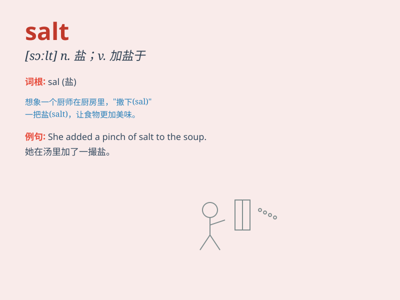

## salt

**英音:** _[sɔːlt; sɒlt]_ **美音:** _[sɔlt]_

**译义:**
*n.食盐,风趣,刺激adj.含盐的,咸的,风趣的,辛辣的vt.加盐于,用盐腌 SALT
[缩写] 限制战略武器会谈*

### 短语

+ **table salt:** _食盐；餐桌盐_

+ **salt water:** _盐水_

+ **salt mine:** _盐矿_

+ **rock salt:** _岩盐_

+ **salt and pepper:** _椒盐；（头发）黑白相间_

### 例句

#### 例句1

> **The chef added a pinch of salt to the soup.**

**中文翻译:** 厨师往汤里加了一撮盐。

**单词释义:** 盐

#### 例句2

> **She has salt and pepper hair.**

**中文翻译:** 她有花白的头发。

**单词释义:** 盐（这里指像盐和胡椒混合的颜色，形容头发花白）

#### 例句3

> **The experience has salted his character.**

**中文翻译:** 这段经历使他的性格更加坚韧。

**单词释义:** 使更有经验；使更坚定

### 背诵小故事

> Once upon a time, a chef lost his salt while cooking. He searched
everywhere and was very worried. Finally, he found it and the dish was
delicious. Remember, salt is very important for food!

**从前，有个厨师做饭时弄丢了他的盐。他到处找，非常着急。最后，他找到了，菜变得很美味。记住，盐对食物很重要！**

### 图义

