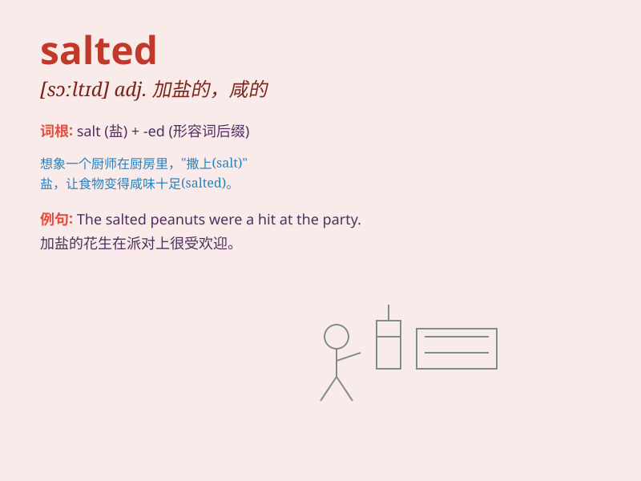

## salted

**英音:** _[\'sɔːltɪd]_ **美音:** _[\'sɔltɪd]_

**译义:** *adj.盐腌的,盐味的,有经验的,(动物)有免疫力的*

### 短语

+ **salted fish:** _咸鱼_

+ **salted peanut:** _咸花生_

+ **salted egg:** _咸鸭蛋_

+ **salted meat:** _咸肉_

+ **salted butter:** _咸黄油_

### 例句

#### 例句1

> **The salted fish tastes very delicious.**

**中文翻译:** 这咸鱼尝起来非常美味。

**单词释义:** 用盐腌制的

#### 例句2

> **She prefers salted peanuts to the sweet ones.**

**中文翻译:** 比起甜花生，她更喜欢咸花生。

**单词释义:** 含盐的；咸的

#### 例句3

> **The salted meat can be stored for a long time.**

**中文翻译:** 这咸肉可以保存很长时间。

**单词释义:** 用盐腌渍过的

### 背诵小故事

> Once upon a time, there was a chef who needed to prepare some special
dishes. He carefully used salted meat to add a rich flavor. The salted
meat was so delicious that everyone loved it. Now you know\'salted\'
means having salt added.

**从前，有个厨师需要准备一些特别的菜肴。他精心使用了腌制的肉来增添浓郁的味道。腌制的肉非常美味，大家都很喜欢。现在你知道了\'salted\'
意思是加了盐的，腌制的。**

### 图义

