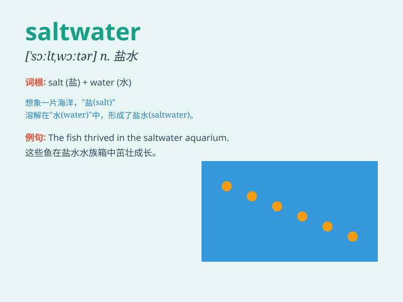

## saltwater

**英音:** _[\'sɔːlt\'wɔːtə]_ **美音:** _[\'sɔlt\'wɔtɚ]_

**译义:** *adj.盐水的,海产的*

### 短语

+ **saltwater fish:** _咸水鱼_

+ **saltwater lake:** _咸水湖_

+ **saltwater crocodile:** _咸水鳄_

+ **saltwater taffy:** _盐水太妃糖_

+ **saltwater ecosystem:** _咸水生态系统_

### 例句

#### 例句1

> **I love swimming in the saltwater of the ocean.**

**中文翻译:** 我喜欢在海洋的咸水中游泳。

**单词释义:** 咸水

#### 例句2

> **The fish can only survive in saltwater environments.**

**中文翻译:** 这种鱼只能在咸水环境中生存。

**单词释义:** 咸水

#### 例句3

> **The saltwater tides can affect the coastal areas.**

**中文翻译:** 咸水潮汐会影响沿海地区。

**单词释义:** 咸水

### 背诵小故事

> A brave sailor was lost at sea. He was thirsty but had only saltwater
to drink. It tasted bad and made him sick. Remember, saltwater is not
for drinking!

**一位勇敢的水手在海上迷路了。他很渴，但只有海水能喝。海水味道很差，还让他生病了。记住，海水不能喝！**

### 图义

