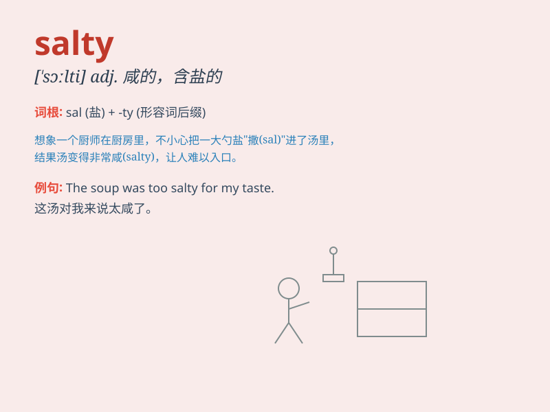

## salty

**英音:** _[\'sɔːltɪ; \'sɒ-]_ **美音:** _[\'sɔlti]_

**译义:** *adj.有盐分的,咸味浓的*

### 短语

+ **salty food:** _咸的食物_

+ **salty taste:** _咸味_

+ **salty water:** _盐水_

+ **salty wind:** _含盐的风_

+ **salty language:** _粗俗的语言_

### 例句

#### 例句1

> **The soup is too salty for my taste.**

**中文翻译:** 这汤对我来说太咸了。

**单词释义:** 咸的

#### 例句2

> **He has a salty personality and always makes sharp remarks.**

**中文翻译:** 他性格尖刻，总是言辞犀利。

**单词释义:** 尖刻的；辛辣的

#### 例句3

> **The sailor had many salty tales to tell of his adventures at
sea.**

**中文翻译:** 这位水手有许多关于他在海上冒险的有趣故事可讲。

**单词释义:** 有趣但略带粗俗的

### 背诵小故事

> One day, a little mouse went to the kitchen and found a bag of salt.
He tasted it and said, \'Oh, this is so salty!\' From then on, whenever
he saw salt, he remembered that salty taste.

**有一天，一只小老鼠跑到厨房，发现了一袋盐。它尝了尝然后说：'哦，这太咸了！'从那以后，每当它看到盐，就会想起那种咸咸的味道。**

### 图义

