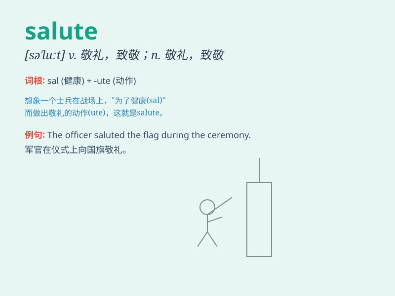

## salute

**英音:** _[sə\'l(j)uːt]_ **美音:** _[sə\'lut]_

**译义:**
*n.(尤指军队等之)举手礼,升降旗致敬,呜礼炮等,敬礼v.行礼致敬,敬礼*

### 短语

+ **military salute:** _军礼_

+ **salute to:** _向\...致敬_

+ **stand at salute:** _立正敬礼_

+ **exchange salutes:** _互致敬意_

+ **salute smartly:** _利落地敬礼_

### 例句

#### 例句1

> **The soldiers saluted the flag with respect.**

**中文翻译:** 士兵们怀着敬意向旗帜敬礼。

**单词释义:** 敬礼

#### 例句2

> **We salute your courage and determination.**

**中文翻译:** 我们钦佩你的勇气和决心。

**单词释义:** 称赞；赞扬

#### 例句3

> **The president saluted the achievements of the scientists.**

**中文翻译:** 总统赞扬了科学家们的成就。

**单词释义:** 赞扬；致敬

### 背诵小故事

> A soldier was standing in the rain. A little girl came and saluted
him. The soldier smiled and saluted back. The act of saluting showed
respect and honor.

**一名士兵正站在雨中。一个小女孩走过来向他敬礼。士兵微笑着回敬了礼。敬礼这个动作展现了尊重和敬意。**

### 图义

