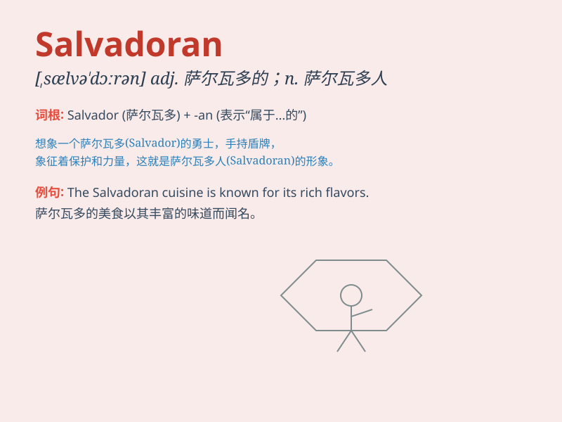

## Salvadoran

**英音:** _[ˌsælvəˈdɔːrən]_ **美音:** _[ˌsælvəˈdɔːrən]_

**译义:** *adj.萨尔瓦多的；萨尔瓦多人（或语）的
n.萨尔瓦多人；萨尔瓦多语*

### 短语

+ **Salvadoran peso:** _萨尔瓦多比索（萨尔瓦多货币）_

+ **Salvadoran cuisine:** _萨尔瓦多美食_

+ **Salvadoran culture:** _萨尔瓦多文化_

+ **Salvadoran history:** _萨尔瓦多历史_

+ **Salvadoran people:** _萨尔瓦多人_

### 例句

#### 例句1

> **The Salvadoran cuisine is known for its rich flavors.**

**中文翻译:** 萨尔瓦多的美食以其丰富的口味而闻名。

**单词释义:** 萨尔瓦多的；萨尔瓦多人的

#### 例句2

> **She has many Salvadoran friends.**

**中文翻译:** 她有很多萨尔瓦多朋友。

**单词释义:** 萨尔瓦多的；萨尔瓦多人的

#### 例句3

> **The Salvadoran government is working on improving the
economy.**

**中文翻译:** 萨尔瓦多政府正在努力改善经济。

**单词释义:** 萨尔瓦多的；萨尔瓦多人的

### 背诵小故事

> Once upon a time, there was a traveler named Tom. He met a friendly
Salvadoran in a small village. The Salvadoran showed him around and
shared local customs. Tom was deeply impressed by the Salvadoran\'s
kindness.

**从前，有个叫汤姆的旅行者。他在一个小村庄里遇到了一位友好的萨尔瓦多人。这位萨尔瓦多人带他四处参观并分享了当地习俗。汤姆对这位萨尔瓦多人的友善印象深刻。**

### 图义

