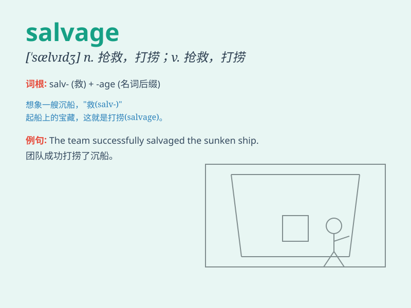

## salvage

**英音:** _[\'sælvɪdʒ]_ **美音:** _[\'sælvɪdʒ]_

**译义:**
*n.抢救财货,获救的财货,救难的奖金,海上救助,抢救,打捞vt.海上救助,抢救,打捞,营救*

### 短语

+ **salvage operation:** _抢救行动；打捞作业_

+ **salvage value:** _残值；废料价值_

+ **salvage yard:** _废品回收站；废车处理场_

+ **salvage rights:** _救助权；打捞权_

+ **salvage effort:** _抢救努力；挽救努力_

### 例句

#### 例句1

> **The salvage team worked hard to retrieve the sunken ship.**

**中文翻译:** 救援团队努力工作以打捞沉船。

**单词释义:** 打捞，抢救

#### 例句2

> **They managed to salvage some of the damaged goods after the
fire.**

**中文翻译:** 火灾后他们设法抢救了一些受损的货物。

**单词释义:** 抢救，挽救

#### 例句3

> **The company is trying to salvage its reputation after the
scandal.**

**中文翻译:** 这家公司在丑闻之后正努力挽回声誉。

**单词释义:** 挽回，拯救

### 背诵小故事

> A ship was sinking, but the brave sailors worked hard to salvage the
valuable cargo. They risked their lives to save as much as they could.
Finally, they succeeded and the salvaged goods were safe.

**一艘船正在沉没，但勇敢的水手们努力抢救有价值的货物。他们冒着生命危险尽可能多地挽救。最终，他们成功了，抢救出的货物安全了。**

### 图义

