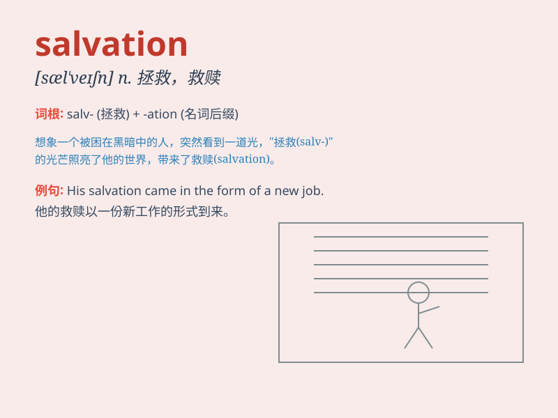

## salvation

**英音:** _[sæl\'veɪʃ(ə)n]_ **美音:** _[sæl\'veʃən]_

**译义:** *n.拯救,救助*

### 短语

+ **salvation army:**
_救世军（基督教的一种传教组织，以街头布道和慈善活动闻名）_

+ **path to salvation:** _救赎之路；得救之道_

+ **hope of salvation:** _得救的希望_

+ **seek salvation:** _寻求救赎_

+ **offer salvation:** _提供救赎_

### 例句

#### 例句1

> **Prayer brought her the salvation she sought.**

**中文翻译:** 祈祷为她带来了她所寻求的救赎。

**单词释义:** 救赎；拯救

#### 例句2

> **The new treatment offers hope of salvation for patients with this
disease.**

**中文翻译:** 新的治疗方法为患有这种疾病的患者带来了拯救的希望。

**单词释义:** 拯救；解救

#### 例句3

> **He saw education as the salvation of the country.**

**中文翻译:** 他把教育视为这个国家的救星。

**单词释义:** 救星；解救办法

### 背诵小故事

> A man was lost in a dark forest, feeling hopeless. But when he saw a
light in the distance, he knew it was his salvation. The light guided
him out of the forest and to safety. Salvation means being saved from
danger or difficulty.

**一个男人在黑暗的森林中迷路了，感到绝望。但当他看到远处的一束光，他知道那是他的救赎。这束光引导他走出森林，到达安全之地。salvation
意思是从危险或困境中得救。**

### 图义

