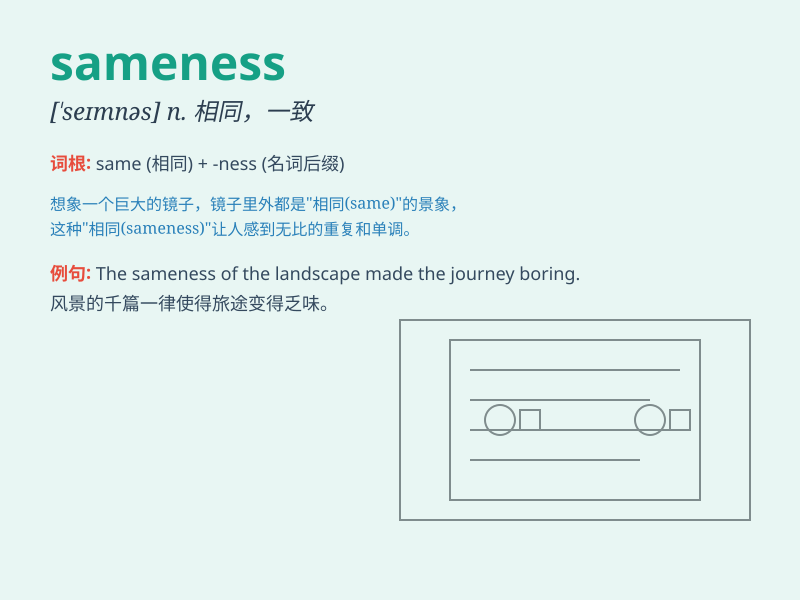

## sameness

**英音:** _[\'seɪmnɪs]_ **美音:** _[\'semnəs]_

**译义:** *n.同一,一致性,千篇一律,同一性*

### 短语

+ **sense of sameness:** _相同感_

+ **uniform sameness:** _统一的相同性_

+ **total sameness:** _完全相同_

+ **relative sameness:** _相对的相同_

+ **absolute sameness:** _绝对的相同_

### 例句

#### 例句1

> **The sameness of the landscape was both calming and
monotonous.**

**中文翻译:** 这片风景的一成不变既让人平静又显得单调。

**单词释义:** 相同；一致性

#### 例句2

> **Despite the sameness of the products, some managed to stand
out.**

**中文翻译:** 尽管产品具有相同性，但有些还是成功脱颖而出。

**单词释义:** 相同；类似

#### 例句3

> **She was tired of the sameness of her daily routine.**

**中文翻译:** 她厌倦了日常惯例的千篇一律。

**单词释义:** 千篇一律；无变化

### 背诵小故事

> Once upon a time, in a magical forest, all the trees had the exact
same shape and color. This state of being exactly alike was called
\'sameness\'. It made the forest look strange and lacking variety.

**从前，在一个神奇的森林里，所有的树都有着完全相同的形状和颜色。这种完全一样的状态就被称为"sameness"。这让森林看起来很奇怪并且缺乏多样性。**

### 图义

