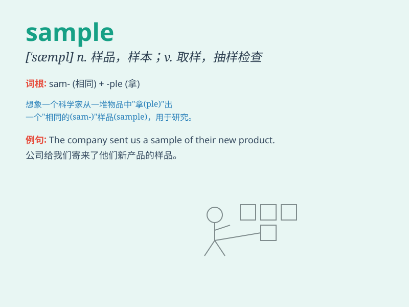

## sample

**英音:** _[\'sɑːmp(ə)l]_ **美音:** _[\'sæmpl]_

**译义:**
*n.标本,样品,例子vt.取样,采样,抽取\...的样品,试验的一部分,尝试*

### 短语

+ **sample size:** _样本量；样本大小_

+ **random sample:** _随机样本_

+ **sample survey:** _抽样调查_

+ **test sample:** _测试样本；检验样品_

+ **blood sample:** _血液样本；血样_

### 例句

#### 例句1

> **They took a sample of my blood for testing.**

**中文翻译:** 他们抽取了我的血液样本进行检测。

**单词释义:** 样本；样品

#### 例句2

> **This song is a sample of his latest album.**

**中文翻译:** 这首歌是他最新专辑的一个样本。

**单词释义:** 样本；样品

#### 例句3

> **The company provides free samples of its products.**

**中文翻译:** 这家公司提供其产品的免费样品。

**单词释义:** 样品；样本

### 背诵小故事

> A scientist needed a sample of a rare plant for research. He searched
far and wide. Finally, he found a small sample in a hidden forest. It
was like finding a precious treasure.

**一位科学家需要一份稀有植物的样本用于研究。他四处寻找。最终，他在一片隐蔽的森林里找到了一小份样本。这就像找到了珍贵的宝藏。**

### 图义

