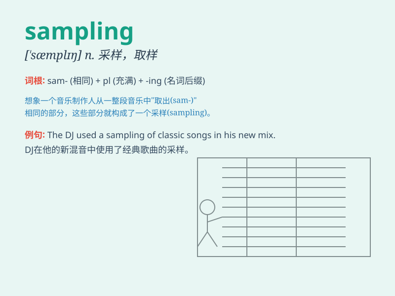

## sampling

**英音:** _[\'sɑːmplɪŋ]_ **美音:** _[\'sæmplɪŋ]_

**译义:** *取样v.取样*

### 短语

+ **random sampling:** _随机抽样_

+ **sampling method:** _抽样方法_

+ **sampling frequency:** _采样频率_

+ **sampling error:** _抽样误差_

+ **sampling distribution:** _抽样分布_

### 例句

#### 例句1

> **The sampling of the soil was done carefully to ensure accurate
analysis.**

**中文翻译:** 土壤的采样工作做得很仔细，以确保分析准确。

**单词释义:** 采样；抽样

#### 例句2

> **Sampling of the music was used to create a new remix.**

**中文翻译:** 对音乐进行采样被用于创作新的混音。

**单词释义:** 采样；抽样

#### 例句3

> **The quality control team checks the sampling of the products
regularly.**

**中文翻译:** 质量控制团队定期检查产品的抽样情况。

**单词释义:** 抽样；取样

### 背诵小故事

> A scientist was doing sampling in a forest. He collected various
leaves and soil to study. The act of taking these small parts for
research was called sampling.

**一位科学家在森林里进行采样。他收集了各种各样的树叶和土壤用于研究。这种抽取这些小部分用于研究的行为被称为采样。**

### 图义

