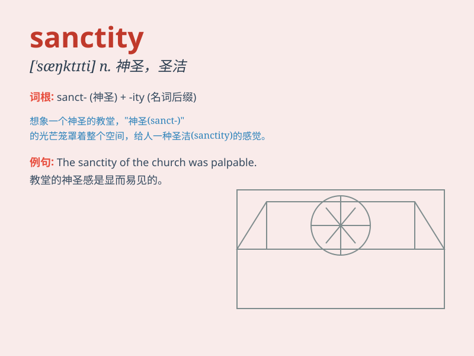

## sanctity

**英音:** _[\'sæŋ(k)tɪtɪ]_ **美音:** _[\'sæŋktəti]_

**译义:** *n.圣洁*

### 短语

+ **sanctity of life:** _生命的神圣性_

+ **preserve the sanctity:** _维护神圣性_

+ **sanctity of marriage:** _婚姻的神圣性_

+ **violate the sanctity:** _侵犯神圣性_

+ **uphold the sanctity:** _坚持神圣性_

### 例句

#### 例句1

> **The sanctity of human life must be protected at all costs.**

**中文翻译:** 人的生命的神圣性必须不惜一切代价加以保护。

**单词释义:** 神圣；圣洁

#### 例句2

> **He violated the sanctity of the church.**

**中文翻译:** 他亵渎了教堂的神圣。

**单词释义:** 神圣不可侵犯性

#### 例句3

> **We should respect the sanctity of marriage.**

**中文翻译:** 我们应该尊重婚姻的神圣。

**单词释义:** 神圣性

### 背诵小故事

> A monk devoted his life to maintaining the sanctity of the ancient
temple. He prayed every day, protected its relics, and kept away
intruders. His dedication showed the true meaning of sanctity - the
state of being holy and sacred.

**一位僧侣一生致力于维护古老寺庙的神圣性。他每天祈祷，保护其遗物，并赶走入侵者。他的奉献展现了sanctity（神圣性）的真正含义------神圣和庄严的状态。**

### 图义

