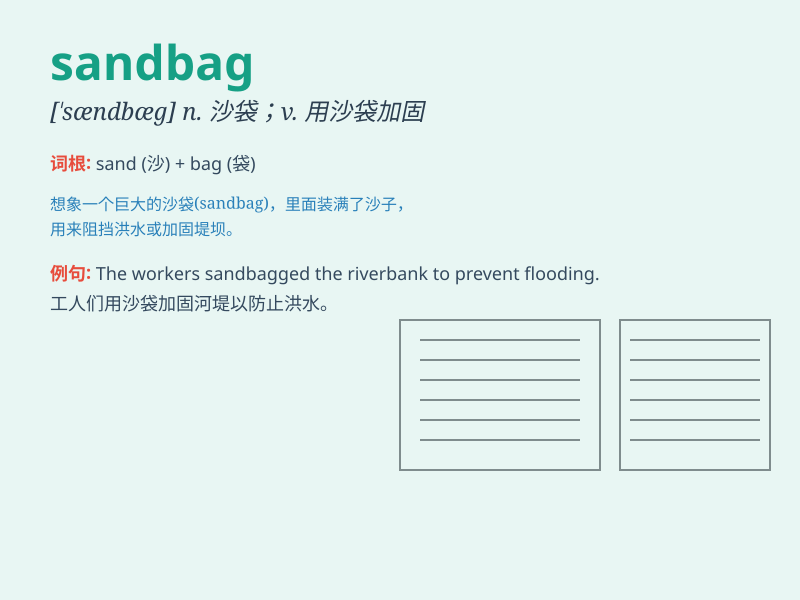

## sandbag

**英音:** _[\'sæn(d)bæg]_ **美音:** _[\'sændbæɡ]_

**译义:** *n.沙袋vt.堆沙袋,用沙袋打*

### 短语

+ **sandbag barrier:** _沙袋屏障_

+ **sandbag flood protection:** _沙袋防洪_

+ **fill sandbags:** _装满沙袋_

+ **stack sandbags:** _堆叠沙袋_

+ **sandbag defense:** _沙袋防御_

### 例句

#### 例句1

> **The soldiers used sandbags to build a protective barrier.**

**中文翻译:** 士兵们用沙袋筑起了一道防护屏障。

**单词释义:** 沙袋

#### 例句2

> **They sandbagged the leak to prevent further flooding.**

**中文翻译:** 他们用沙袋堵住了漏洞以防止洪水进一步泛滥。

**单词释义:** 用沙袋堵住

#### 例句3

> **The workers were busy sandbagging the riverbank.**

**中文翻译:** 工人们正忙着在河岸堆沙袋。

**单词释义:** 堆沙袋

### 背诵小故事

> In a flood-stricken area, people were busy filling sand into bags to
build a protective barrier. The sandbags were heavy, but they were the
key to keeping the water away. \'Sandbag\' thus represents these
protective items filled with sand.

**在一个洪水泛滥的地区，人们忙着把沙子装进袋子里以建造防护屏障。沙袋很重，但它们是阻挡洪水的关键。'sandbag'因此代表这些装满沙子的防护物品。**

### 图义

