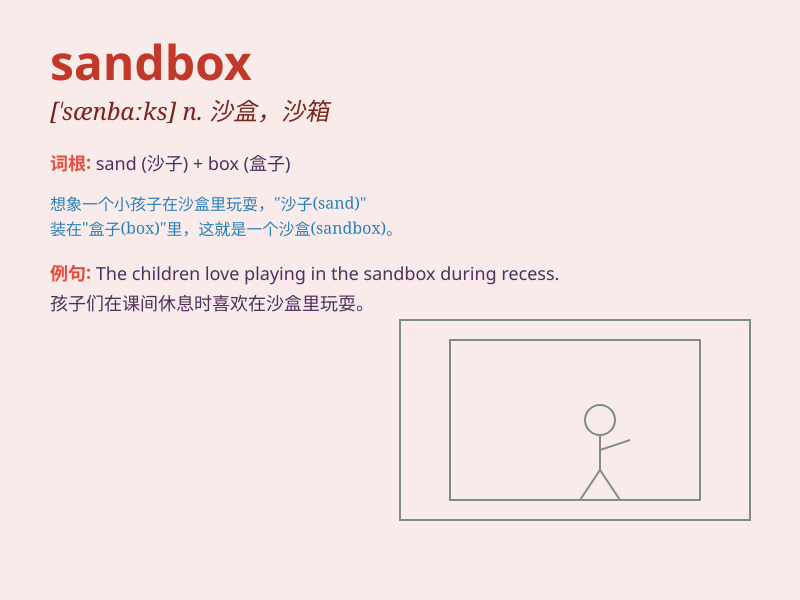

## sandbox

**英音:** _[\'sæn(d)bɒks]_ **美音:** _[\'sændbɑks]_

**译义:** *n.沙箱,沙盒*

### 短语

+ **sandbox game:** _沙盒游戏_

+ **sandbox environment:** _沙盒环境_

+ **sandbox testing:** _沙盒测试_

+ **play in the sandbox:** _在沙盒里玩_

+ **sandbox model:** _沙盒模型_

### 例句

#### 例句1

> **The children were playing in the sandbox.**

**中文翻译:** 孩子们正在沙箱里玩耍。

**单词释义:** 沙箱

#### 例句2

> **The new software is being tested in a sandbox environment.**

**中文翻译:** 新软件正在沙盒环境中进行测试。

**单词释义:** 沙盒（用于安全测试的隔离环境）

#### 例句3

> **He built a small sandbox in his backyard for his kids.**

**中文翻译:** 他在自家后院为孩子们建了一个小沙箱。

**单词释义:** 沙箱

### 背诵小故事

> A child was playing in the sandbox. He built castles and dug holes.
The sandbox was his little world of fun and imagination. It was filled
with soft sand that felt nice to touch.

**一个孩子正在沙箱里玩耍。他建造城堡和挖洞。沙箱是他充满乐趣和想象的小世界。里面装满了摸起来很舒服的柔软沙子。**

### 图义

