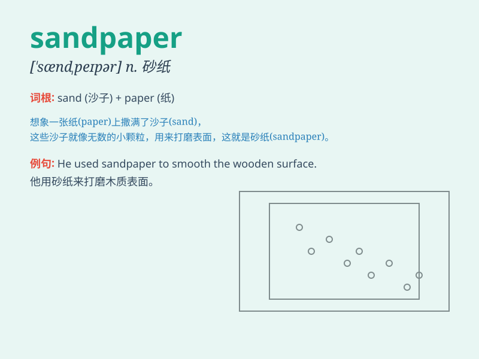

## sandpaper

**英音:** _[\'sæn(d)peɪpə]_ **美音:** _[\'sændpepɚ]_

**译义:** *n.沙纸*

### 短语

+ **sandpaper disk:** _砂纸盘_

+ **coarse sandpaper:** _粗砂纸_

+ **fine sandpaper:** _细砂纸_

+ **sandpaper grit:** _砂纸粒度_

+ **sandpaper sheet:** _砂纸片_

### 例句

#### 例句1

> **He used sandpaper to smooth the rough surface of the wood.**

**中文翻译:** 他用砂纸来打磨木头粗糙的表面。

**单词释义:** 砂纸

#### 例句2

> **The carpenter always keeps a stack of sandpaper in his
workshop.**

**中文翻译:** 这位木匠总是在他的工作间里存放一叠砂纸。

**单词释义:** 砂纸

#### 例句3

> **You need to apply more pressure when using the sandpaper.**

**中文翻译:** 使用砂纸的时候你需要施加更大的压力。

**单词释义:** 砂纸

### 背诵小故事

> One day, Tom was building a wooden chair. But the surface was rough.
So he took out some sandpaper to make it smooth. The sandpaper did the
magic and the chair was perfect.

**有一天，汤姆正在制作一把木椅子。但表面很粗糙。于是他拿出一些砂纸来把它磨光滑。砂纸发挥了神奇的作用，椅子变得完美了。**

### 图义

