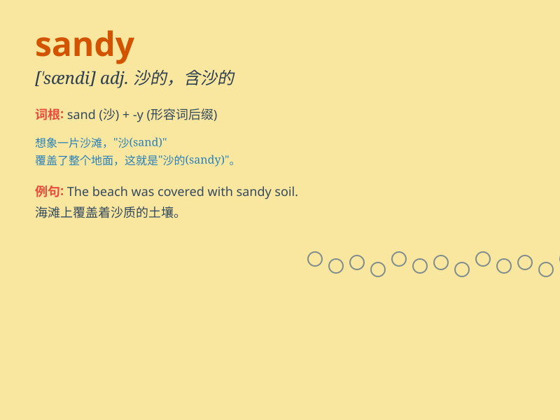

## sandy

**英音:** _[\'sændɪ]_ **美音:** _[\'sændi]_

**译义:** *adj.沙的,含沙的,沙质 Sandy 桑迪(男子名)*

### 短语

+ **sandy beach:** _沙滩_

+ **sandy soil:** _沙质土壤_

+ **sandy hair:** _沙色的头发_

+ **sandy complexion:** _浅棕色的肤色_

+ **sandy desert:** _沙质荒漠_

### 例句

#### 例句1

> **The sandy beach is perfect for sunbathing.**

**中文翻译:** 这片沙质的海滩非常适合晒日光浴。

**单词释义:** 沙质的

#### 例句2

> **She has sandy hair.**

**中文翻译:** 她有一头沙色的头发。

**单词释义:** 沙色的

#### 例句3

> **The path through the sandy desert was long and arduous.**

**中文翻译:** 穿过这片沙质沙漠的道路漫长而艰难。

**单词释义:** 沙质的；多沙的

### 背诵小故事

> Sandy was a little girl who loved playing on the sandy beach. Every
time she stepped on the soft, golden sand, she felt happy. One day, she
even built a big sandcastle. The sand beneath her feet was warm and
inviting.

**桑迪是个喜欢在沙滩上玩耍的小女孩。每次她踩在柔软的金色沙子上，都感到很开心。有一天，她甚至建了一座大沙堡。她脚下的沙子温暖又诱人。**

### 图义

