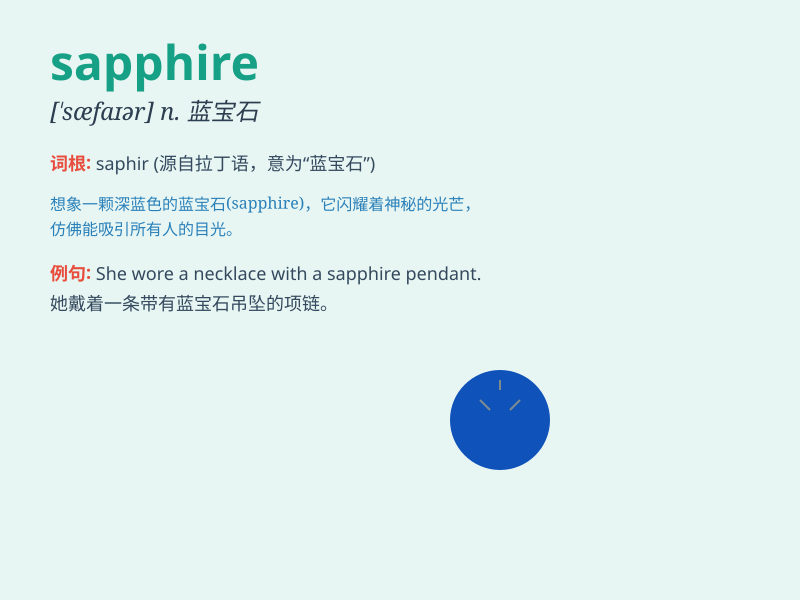

## sapphire

**英音:** _[\'sæfaɪə]_ **美音:** _[\'sæfaɪɚ]_

**译义:** *n.兰宝石*

### 短语

+ **sapphire blue:** _蓝宝石色，宝蓝色_

+ **sapphire crystal:** _蓝宝石晶体_

+ **star sapphire:** _星彩蓝宝石_

+ **sapphire ring:** _蓝宝石戒指_

+ **sapphire necklace:** _蓝宝石项链_

### 例句

#### 例句1

> **She wore a beautiful sapphire ring on her finger.**

**中文翻译:** 她手指上戴着一枚漂亮的蓝宝石戒指。

**单词释义:** 蓝宝石

#### 例句2

> **The sky was a deep sapphire color at dusk.**

**中文翻译:** 黄昏时天空呈现出深邃的蓝宝石色。

**单词释义:** 蓝宝石色

#### 例句3

> **His eyes were as clear as sapphire.**

**中文翻译:** 他的眼睛像蓝宝石一样清澈。

**单词释义:** 蓝宝石；蓝宝石般的

### 背诵小故事

> A brave knight was on a quest. In a hidden cave, he found a magical
sapphire. The gem shone so bright, guiding him out of danger. It was
like a blue star, giving him hope and strength.

**一位勇敢的骑士在探险。在一个隐蔽的洞穴里，他发现了一颗神奇的蓝宝石。这颗宝石闪耀得如此明亮，引导他脱离了危险。它就像一颗蓝色的星星，给了他希望和力量。**

### 图义

