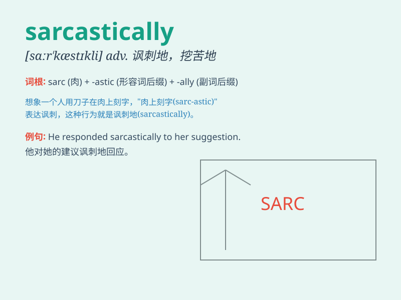

## sarcastically

**英音:** _[sɑːˈkæstɪk(ə)li]_ **美音:** _[sɑrˈkæstɪkli]_

**译义:** *adv.讽刺地,辛辣地*

### 短语

+ **speak sarcastically:** _讽刺地说_

+ **reply sarcastically:** _讽刺地回答_

+ **laugh sarcastically:** _讽刺地笑_

+ **comment sarcastically:** _讽刺地评论_

+ **act sarcastically:** _讽刺地表现_

### 例句

#### 例句1

> **He sarcastically commented on her new dress.**

**中文翻译:** 他讽刺地评论了她的新裙子。

**单词释义:** 以讽刺的方式

#### 例句2

> **She laughed sarcastically when she heard the excuse.**

**中文翻译:** 当她听到这个借口时，她讽刺地笑了。

**单词释义:** 带着讽刺意味地

#### 例句3

> **The audience responded sarcastically to his speech.**

**中文翻译:** 观众对他的演讲做出了讽刺性的回应。

**单词释义:** 讽刺地

### 背诵小故事

> One day, Tom failed his exam. His friend John said sarcastically,
\'Oh, you must be a genius!\' Tom felt hurt. This shows how
\'sarcastically\' means in a mocking and ironic way.

**有一天，汤姆考试不及格。他的朋友约翰讽刺地说：'哦，你一定是个天才！'汤姆感到很受伤。这展示了'sarcastically'是以嘲笑和讽刺的方式的意思。**

### 图义

