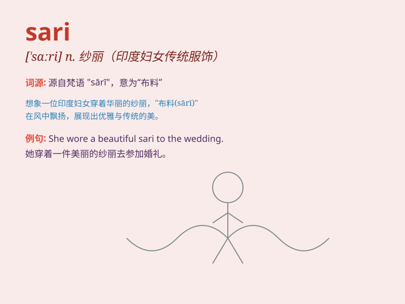

## sari

**英音:** _[\'sɑːrɪ]_ **美音:** _[\'sɑri]_

**译义:** *n.卷布,纱丽*

### 短语

+ **sari fabric:** _纱丽面料_

+ **wedding sari:** _婚礼纱丽_

+ **traditional sari:** _传统纱丽_

+ **embroidered sari:** _绣花纱丽_

+ **silk sari:** _丝绸纱丽_

### 例句

#### 例句1

> **She wore a beautiful sari to the wedding.**

**中文翻译:** 她穿着一件漂亮的莎丽去参加婚礼。

**单词释义:** 莎丽（印度妇女的裹身长巾）

#### 例句2

> **The shop sells a variety of saris in different colors and
patterns.**

**中文翻译:** 这家商店出售各种颜色和图案的莎丽。

**单词释义:** 莎丽（印度妇女的裹身长巾）

#### 例句3

> **The dancer twirled gracefully in her sari.**

**中文翻译:** 舞者穿着她的莎丽优雅地旋转。

**单词释义:** 莎丽（印度妇女的裹身长巾）

### 背诵小故事

> A beautiful princess wore a sari to the grand ball. The sari was
colorful and had exquisite patterns. Everyone was amazed by her
elegance. The sari made her the star of the night.

**一位美丽的公主穿着纱丽去参加盛大的舞会。纱丽色彩斑斓，有着精美的图案。每个人都为她的优雅而惊叹。纱丽让她成为了当晚的明星。**

### 图义

