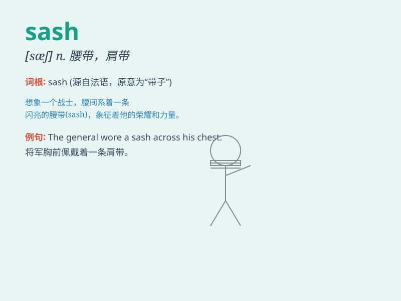

## sash

**英音:** _[sæʃ]_ **美音:** _[sæʃ]_

**译义:** *n.框格,肩带,腰带,飒饰,窗扇vt.装以窗框,系上腰带*

### 短语

+ **window sash:** _窗框_

+ **sash cord:** _吊窗绳_

+ **sash weight:** _窗锤；吊窗锤_

+ **sash window:** _上下拉动的窗；框格窗_

+ **ornamental sash:** _装饰性腰带_

### 例句

#### 例句1

> **She wore a beautiful sash around her waist.**

**中文翻译:** 她在腰间系了一条漂亮的腰带。

**单词释义:** 腰带

#### 例句2

> **The window was adorned with a colorful sash.**

**中文翻译:** 窗户装饰着一条色彩鲜艳的窗带。

**单词释义:** 窗带

#### 例句3

> **He carried the sash of his office with dignity.**

**中文翻译:** 他庄重地佩戴着他的官职绶带。

**单词释义:** 绶带

### 背诵小故事

> A brave knight wore a sash around his waist. The sash was colorful
and made him stand out in the battle. It was not just a piece of cloth
but a symbol of his courage.

**一位勇敢的骑士在腰间系着一条腰带。这条腰带色彩鲜艳，使他在战斗中脱颖而出。它不仅仅是一块布，更是他勇气的象征。**

### 图义

