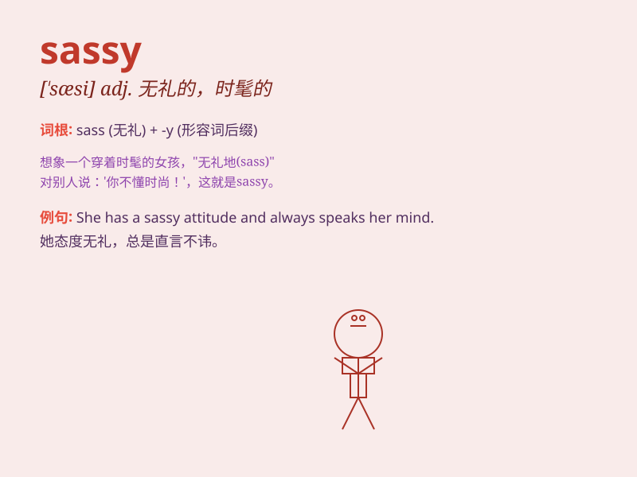

## sassy

**英音:** _[\'sæsɪ]_ **美音:** _[\'sæsi]_

**译义:** *adj.无礼的,失礼的,厚脸皮的,时髦的*

### 短语

+ **sassy girl:** _时髦且俏皮的女孩_

+ **sassy attitude:** _无礼的态度_

+ **sassy comment:** _尖刻的评论_

+ **sassy style:** _时髦大胆的风格_

+ **sassy walk:** _自信且有点傲慢的走路姿态_

### 例句

#### 例句1

> **She\'s got a sassy attitude that sometimes gets her into
trouble.**

**中文翻译:** 她有一种时髦且大胆的态度，有时会给她带来麻烦。

**单词释义:** 时髦且大胆的

#### 例句2

> **The sassy waitress had a quick wit and a sharp tongue.**

**中文翻译:** 这位时髦俏皮的女服务员头脑敏捷，说话尖刻。

**单词释义:** 时髦俏皮的

#### 例句3

> **He couldn\'t handle her sassy remarks and walked away
angrily.**

**中文翻译:** 他无法应对她无礼又时髦的言论，生气地走开了。

**单词释义:** 无礼又时髦的

### 背诵小故事

> A sassy little cat always showed off its shiny fur and walked with a
confident strut. One day, it caught a mouse and gave a sassy look as if
saying, \'I\'m the best hunter!\'

**一只时髦自信的小猫总是炫耀它闪亮的皮毛，自信地大摇大摆地走着。有一天，它抓住了一只老鼠，并露出时髦自信的表情，好像在说：'我是最棒的猎手！'**

### 图义

