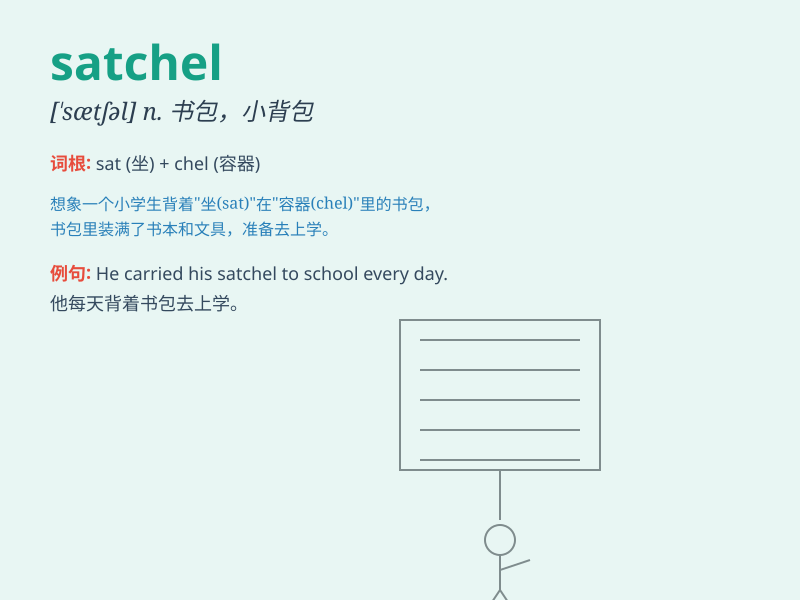

## satchel

**英音:** _[\'sætʃ(ə)l]_ **美音:** _[\'sætʃəl]_

**译义:** *n.书包,小背包*

### 短语

+ **leather satchel:** _皮革挎包_

+ **school satchel:** _书包_

+ **shoulder satchel:** _肩挎包_

+ **canvas satchel:** _帆布挎包_

+ **small satchel:** _小挎包_

### 例句

#### 例句1

> **She carried a small satchel as she walked to school.**

**中文翻译:** 她走路去上学时带着一个小挎包。

**单词释义:** 挎包

#### 例句2

> **The traveler had a heavy satchel filled with essential items.**

**中文翻译:** 这位旅行者有一个装满必需品的沉重的挎包。

**单词释义:** 挎包

#### 例句3

> **He opened his satchel to take out a book.**

**中文翻译:** 他打开他的挎包拿出一本书。

**单词释义:** 挎包

### 背诵小故事

> A little boy was lost in the forest. He carried a satchel filled with
food and a map. The satchel was his hope. It was small but very
important. Finally, he found his way home with the help of the things in
the satchel.

**一个小男孩在森林里迷路了。他背着一个挎包，里面装满了食物和地图。这个挎包是他的希望。它虽小但非常重要。最终，他借助挎包里的东西找到了回家的路。**

### 图义

