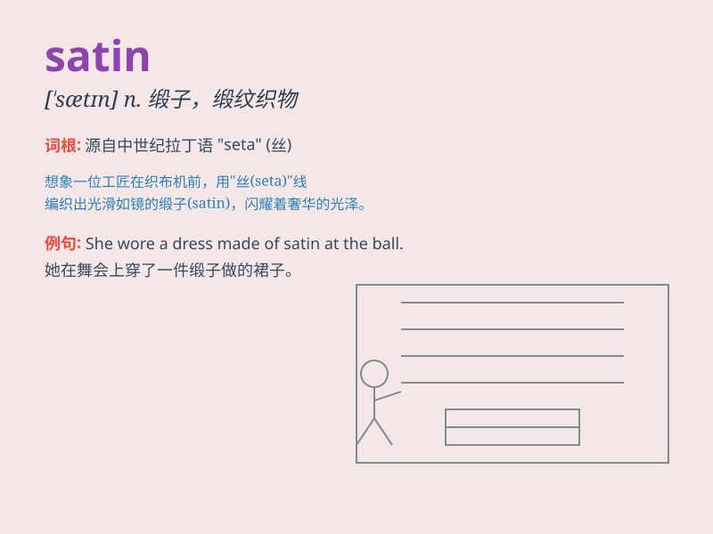

## satin

**英音:** _[\'sætɪn]_ **美音:** _[\'sætn]_

**译义:** *n.缎子,假缎,缎纹adj.绸缎做的,缎子一般的,光滑(似缎)的*

### 短语

+ **satin weave:** _缎纹组织_

+ **satin finish:** _缎面处理；光泽装饰_

+ **satin ribbon:** _缎带_

+ **satin fabric:** _缎纹织物_

+ **satin paper:** _蜡光纸_

### 例句

#### 例句1

> **The dress was made of shiny satin.**

**中文翻译:** 这条裙子是用闪亮的绸缎制成的。

**单词释义:** 绸缎

#### 例句2

> **She wore a pair of satin gloves to the party.**

**中文翻译:** 她戴着一副绸缎手套去参加聚会。

**单词释义:** 绸缎

#### 例句3

> **The satin curtains added an elegant touch to the room.**

**中文翻译:** 绸缎窗帘给房间增添了优雅的氛围。

**单词释义:** 绸缎

### 背诵小故事

> A princess was given a beautiful dress made of satin for her
birthday. The satin fabric was so smooth and shiny that it made her look
like a fairy. She loved it and wore it to every special occasion.

**一位公主在生日时得到了一件用缎子（satin）做的漂亮裙子。这种缎子面料非常光滑和闪亮，让她看起来像个仙女。她很喜欢，每逢特殊场合都会穿上它。**

### 图义

