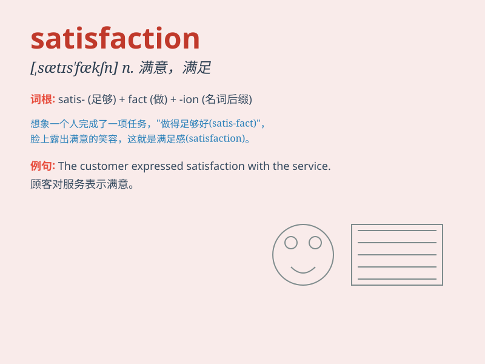

## satisfaction

**英音:** _[sætɪs\'fækʃ(ə)n]_ **美音:**
_[,sætɪs\'fækʃən]_

**译义:** *n.满意,满足,令人满意的事物*

### 短语

+ **job satisfaction:** _工作满意度_

+ **customer satisfaction:** _客户满意度_

+ **degree of satisfaction:** _满意度_

+ **find satisfaction:** _获得满足_

+ **express satisfaction:** _表示满意_

### 例句

#### 例句1

> **The customer expressed satisfaction with the product.**

**中文翻译:** 这位顾客对这个产品表示满意。

**单词释义:** 满意

#### 例句2

> **She derived great satisfaction from helping others.**

**中文翻译:** 她从帮助他人中获得了极大的满足感。

**单词释义:** 满足感

#### 例句3

> **His look of satisfaction showed that he had done a good job.**

**中文翻译:** 他满意的表情表明他工作做得很好。

**单词释义:** 满意

### 背诵小故事

> A hungry man finally got a delicious meal. The taste made him feel
full and happy. This feeling of fullness and joy was his satisfaction.
After that, whenever he thought of that meal, he remembered the
word\'satisfaction\'.

**一个饥饿的人终于得到了一顿美味的饭菜。这种味道让他感到饱足和快乐。这种饱足和快乐的感觉就是他的满足。从那以后，每当他想起那顿饭，他就记住了"satisfaction"这个词。**

### 图义

