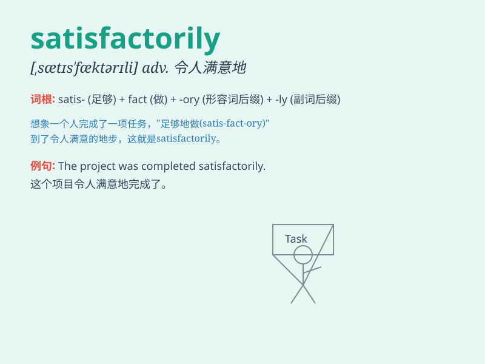

## satisfactorily

**英音:** _[,sætɪs\'fæktərəlɪ]_ **美音:**
_[ˌsætɪs\'fæktərɪlɪ]_

**译义:** *adv.满意地*

### 短语

+ **perform satisfactorily:** _表现令人满意_

+ **function satisfactorily:** _运行良好；正常运转_

+ **complete satisfactorily:** _圆满完成_

+ **settle satisfactorily:** _满意地解决_

+ **answer satisfactorily:** _令人满意地回答_

### 例句

#### 例句1

> **The project was completed satisfactorily within the given time
frame.**

**中文翻译:** 这个项目在给定的时间框架内令人满意地完成了。

**单词释义:** 令人满意地

#### 例句2

> **He performed the task satisfactorily and received praise from his
boss.**

**中文翻译:** 他令人满意地完成了任务，并得到了老板的赞扬。

**单词释义:** 令人满意地

#### 例句3

> **The customer was satisfactorily dealt with by the customer
service team.**

**中文翻译:** 客户被客服团队令人满意地处理了。

**单词释义:** 令人满意地

### 背诵小故事

> A hardworking student spent days preparing for an exam. When the
results came out, he performed satisfactorily. His efforts paid off and
he was happy. It means doing something in a way that is good enough and
meets expectations.

**一个勤奋的学生花了好几天准备考试。成绩出来时，他表现得令人满意。他的努力得到了回报，他很高兴。这个词的意思是以足够好且符合期望的方式做某事。**

### 图义

