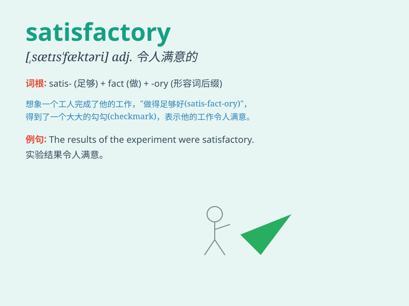

## satisfactory

**英音:** _[sætɪs\'fækt(ə)rɪ]_ **美音:**
_[,sætɪs\'fæktəri]_

**译义:** *adj.满意的,赎罪的*

### 短语

+ **satisfactory result:** _令人满意的结果_

+ **satisfactory performance:** _令人满意的表现_

+ **satisfactory solution:** _令人满意的解决方案_

+ **satisfactory explanation:** _令人满意的解释_

+ **satisfactory progress:** _令人满意的进展_

### 例句

#### 例句1

> **The result of the exam was satisfactory.**

**中文翻译:** 这次考试的结果令人满意。

**单词释义:** 令人满意的

#### 例句2

> **The quality of the product is satisfactory, but could be
better.**

**中文翻译:** 这个产品的质量令人满意，但还可以更好。

**单词释义:** 令人满意的

#### 例句3

> **Her performance at work was satisfactory and she received a
bonus.**

**中文翻译:** 她在工作中的表现令人满意，她得到了奖金。

**单词释义:** 令人满意的

### 背诵小故事

>
想象一下，你参加了一场考试，成绩出来后，虽然不是特别优秀，但也足够让你满意。这种既不是顶尖但又还不错的感觉，就像\'satisfactory\'，意味着令人满意的、符合要求的。

**想象你参加考试的情况来理解\'satisfactory\'这个单词，它表示令人满意的、符合要求的。**

### 图义

