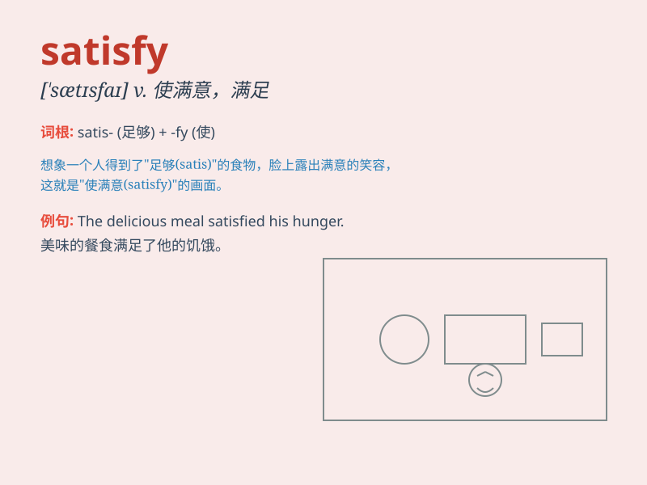

## satisfy

**英音:** _[\'sætɪsfaɪ]_ **美音:** _[\'sætɪsfaɪ]_

**译义:** *vt.满足,使满意,说服,使相信v.满意,确保*

### 短语

+ **satisfy one\'s curiosity:** _满足某人的好奇心_

+ **satisfy the requirements:** _满足要求_

+ **satisfy the needs:** _满足需求_

+ **satisfy oneself:** _使自己确信；弄清楚_

+ **satisfy the hunger:** _充饥；解饿_

### 例句

#### 例句1

> **The meal satisfied my hunger.**

**中文翻译:** 这顿饭满足了我的饥饿感。

**单词释义:** 满足

#### 例句2

> **She tried hard to satisfy her parents\' expectations.**

**中文翻译:** 她努力去满足她父母的期望。

**单词释义:** 使满意

#### 例句3

> **His explanation did not satisfy the jury.**

**中文翻译:** 他的解释没有让陪审团满意。

**单词释义:** 使信服

### 背诵小故事

> One day, Tom was very hungry. When he ate a big pizza, his hunger was
gone and he was satisfied. The pizza fulfilled his need and made him
feel good. It showed that his desire was met.

**一天，汤姆非常饿。当他吃了一个大披萨后，他的饥饿感消失了，他感到满足。披萨满足了他的需求，让他感觉很好。这表明他的欲望得到了满足。**

### 图义

