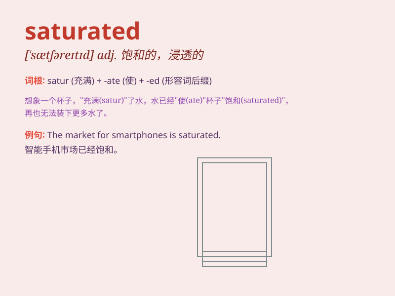

## saturated

**英音:** _[\'sætʃəreɪtɪd]_ **美音:** _[\'sætʃəretɪd]_

**译义:** *adj.渗透的,饱和的,深颜色的*

### 短语

+ **saturated fat:** _饱和脂肪_

+ **saturated solution:** _饱和溶液_

+ **saturated market:** _饱和市场_

+ **saturated steam:** _饱和蒸汽_

+ **saturated color:** _饱和色_

### 例句

#### 例句1

> **The market for smartphones is saturated.**

**中文翻译:** 智能手机市场已经饱和。

**单词释义:** 饱和的

#### 例句2

> **The sponge became saturated with water.**

**中文翻译:** 海绵吸饱了水。

**单词释义:** 浸透的；湿透的

#### 例句3

> **The air was saturated with the smell of flowers.**

**中文翻译:** 空气中弥漫着花香。

**单词释义:** 充满的；饱和的

### 背诵小故事

> Imagine a sponge being soaked in water until it can\'t hold any more.
That\'s what \'saturated\' means. The sponge is completely filled and
soaked through, just like a market is saturated when it has no more room
for new products.

**想象一块海绵在水里浸泡，直到再也吸不进水。这就是"saturated"的意思。海绵完全被填满和浸透，就像一个市场饱和时再也没有容纳新产品的空间。**

### 图义

