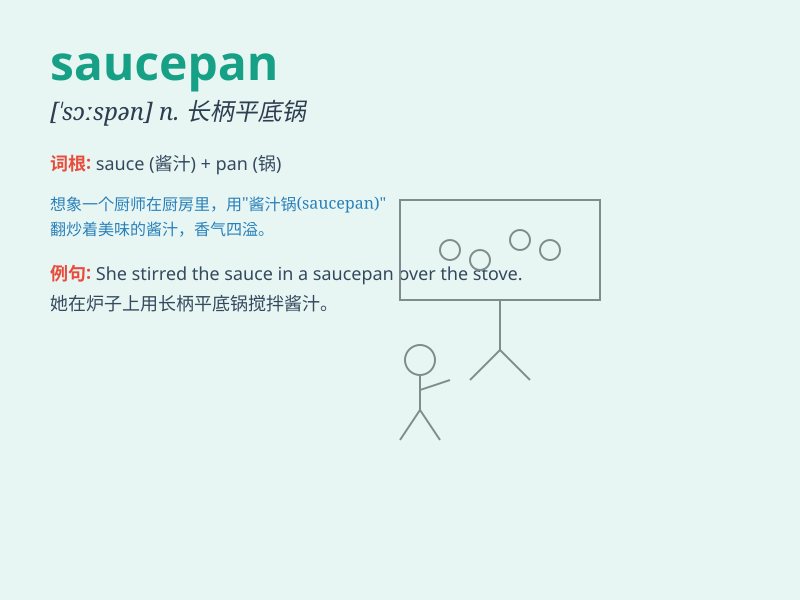

## saucepan

**英音:** _[\'sɔːspən]_ **美音:** _[\'sɔspæn]_

**译义:** *n.长柄而有盖子的深锅,炖锅*

### 短语

+ **stainless steel saucepan:** _不锈钢平底锅_

+ **copper saucepan:** _铜制平底锅_

+ **small saucepan:** _小平底锅_

+ **large saucepan:** _大平底锅_

+ **electric saucepan:** _电平底锅_

### 例句

#### 例句1

> **I need a new saucepan to cook the soup.**

**中文翻译:** 我需要一个新的平底锅来煮汤。

**单词释义:** 平底锅

#### 例句2

> **She washed the dirty saucepan carefully.**

**中文翻译:** 她仔细地洗了那个脏平底锅。

**单词释义:** 平底锅

#### 例句3

> **The saucepan is too small for this dish.**

**中文翻译:** 这个平底锅对于这道菜来说太小了。

**单词释义:** 平底锅

### 背诵小故事

> One day, I was cooking in the kitchen. I needed to boil some soup, so
I took out the saucepan. It was shiny and had a long handle. With it, I
made a delicious soup easily.

**有一天，我在厨房做饭。我需要煮一些汤，所以拿出了平底锅。它闪闪发亮，还有一个长长的手柄。用它，我轻松地煮出了美味的汤。**

### 图义

