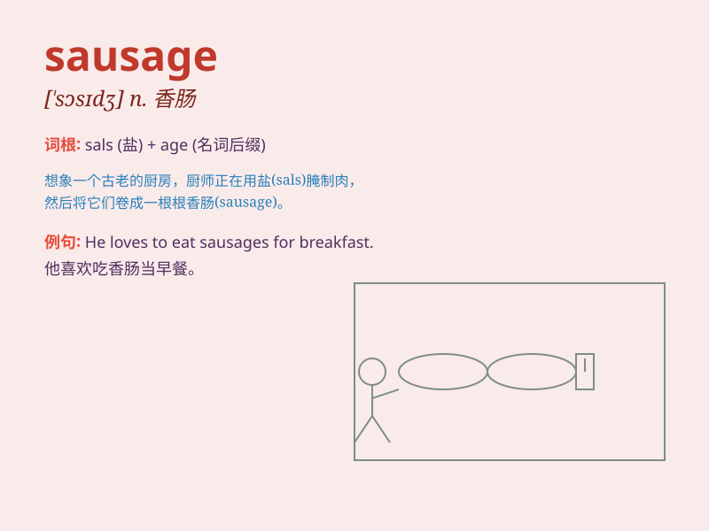

## sausage

**英音:** _[\'sɒsɪdʒ]_ **美音:** _[\'sɔsɪdʒ]_

**译义:** *n.香肠,腊肠*

### 短语

+ **sausage roll:** _香肠卷_

+ **sausage meat:** _香肠肉馅_

+ **beef sausage:** _牛肉香肠_

+ **pork sausage:** _猪肉香肠_

+ **chicken sausage:** _鸡肉香肠_

### 例句

#### 例句1

> **I had a sausage for breakfast.**

**中文翻译:** 我早餐吃了一根香肠。

**单词释义:** 香肠

#### 例句2

> **The sausage smells delicious.**

**中文翻译:** 这根香肠闻起来很香。

**单词释义:** 香肠

#### 例句3

> **She bought some sausages from the market.**

**中文翻译:** 她从市场买了一些香肠。

**单词释义:** 香肠（复数）

### 背诵小故事

> One day, a little pig was very worried because it knew it would
become a sausage. But in the end, the sausage was loved by everyone for
its delicious taste. Remember, sausage means a kind of food made of
minced meat.

**有一天，一只小猪非常担心，因为它知道自己会变成香肠。但最后，这种香肠因其美味而受到大家喜爱。记住，sausage
意思是一种用碎肉制成的食物。**

### 图义

