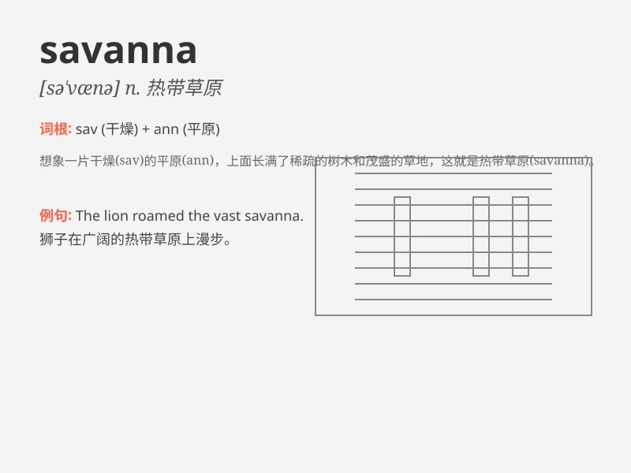

## savanna

**英音:** _[sə\'vænə]_ **美音:** _[sə\'vænə]_

**译义:** *n.热带(或亚热带)稀树大草原*

### 短语

+ **savanna climate:** _热带草原气候_

+ **savanna grassland:** _热带稀树草原_

+ **savanna ecosystem:** _热带草原生态系统_

+ **tropical savanna:** _热带稀树草原_

+ **savanna region:** _热带草原地区_

### 例句

#### 例句1

> **The savanna is home to many wild animals such as lions and
zebras.**

**中文翻译:** 稀树草原是许多野生动物的家园，比如狮子和斑马。

**单词释义:** 稀树草原

#### 例句2

> **We went on a safari in the savanna and saw beautiful
landscapes.**

**中文翻译:** 我们在稀树草原上进行了一次狩猎旅行，看到了美丽的风景。

**单词释义:** 稀树草原

#### 例句3

> **The climate of the savanna is hot and dry for most of the
year.**

**中文翻译:** 稀树草原的气候在一年中的大部分时间里炎热干燥。

**单词释义:** 稀树草原

### 背诵小故事

> A brave explorer was lost in a vast land. He was thirsty and tired.
Suddenly, he saw a wide expanse of savanna with tall grass and scattered
trees. He knew he was close to finding water and a way out.

**一位勇敢的探险家在一片广阔的土地上迷路了。他又渴又累。突然，他看到了一片广阔的稀树草原，有高高的草和零星的树木。他知道自己快要找到水和出路了。**

### 图义

