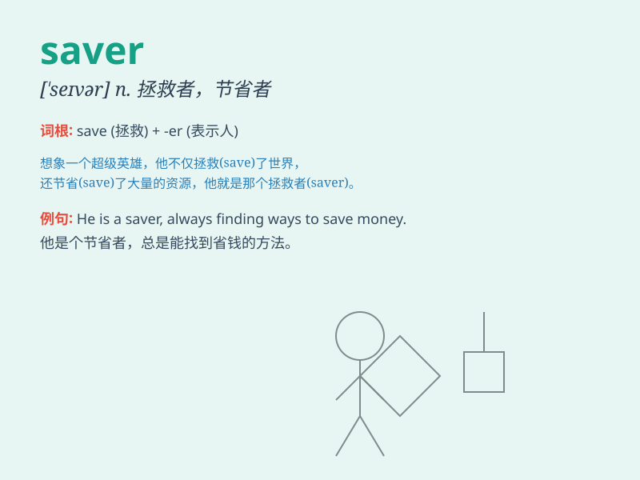

## saver

**英音:** _[\'seɪvə]_ **美音:** _[\'sevɚ]_

**译义:** *n.救助者,节俭的人*

### 短语

+ **energy saver:** _节能器_

+ **money saver:** _省钱的办法；省钱者_

+ **life saver:** _救命者；救生用品_

+ **time saver:** _节省时间的事物（或方法）_

+ **space saver:** _节省空间的设备（或物品）_

### 例句

#### 例句1

> **The new energy-efficient appliance is a great saver for our
electricity bills.**

**中文翻译:** 这种新的节能电器大大节省了我们的电费。

**单词释义:** 节省者；节约装置

#### 例句2

> **He is a saver who always manages to put aside some money each
month.**

**中文翻译:** 他是个节省的人，每个月总能设法存一些钱。

**单词释义:** 储蓄者；节俭的人

#### 例句3

> **This coupon is a saver for shoppers looking to cut costs.**

**中文翻译:**
这张优惠券对于想要降低成本的购物者来说是个省钱的好办法。

**单词释义:** 节省物；节省途径

### 背诵小故事

> One day, Tom lost his wallet. But luckily, a kind stranger named Jack
was a saver. Jack found the wallet and returned it to Tom. Tom was very
grateful and realized that savers like Jack bring hope and joy.

**一天，汤姆丢了钱包。但幸运的是，一个叫杰克的好心人是个救助者。杰克捡到了钱包并归还给了汤姆。汤姆非常感激，并意识到像杰克这样的救助者带来了希望和欢乐。**

### 图义

