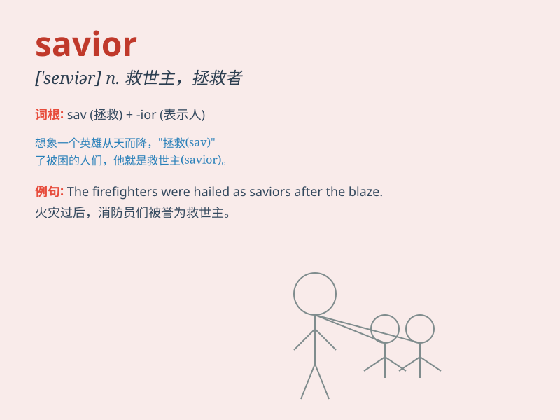

## savior

**英音:** _[\'seɪvjə(r)]_ **美音:** _[\'seɪvjər]_

**译义:** *n.救助者,救世主,救星,耶稣基督*

### 短语

+ **savior complex:** _救世情结_

+ **the Savior:** _救世主_

+ **savior sibling:**
_救星同胞（通过胚胎植入前基因诊断技术出生，其脐带血等可用于救治患病的兄姐）_

+ **potential savior:** _潜在的救星_

+ **emergency savior:** _紧急救星_

### 例句

#### 例句1

> **The doctor was seen as the savior of the patient\'s life.**

**中文翻译:** 这位医生被视为这个病人生命的救星。

**单词释义:** 救星；救助者

#### 例句2

> **In times of crisis, people often look for a savior to lead them
out of difficulty.**

**中文翻译:** 在危机时刻，人们常常寻找一位救星带领他们走出困境。

**单词释义:** 救星；拯救者

#### 例句3

> **He believed that technology would be the savior of the
environment.**

**中文翻译:** 他相信技术会是环境的拯救者。

**单词释义:** 拯救者；挽救者

### 背诵小故事

> One day, a village was in great danger. Just when everyone was
desperate, a brave man appeared. He used his wisdom and courage to save
the village. People called him the savior.

**有一天，一个村庄陷入了巨大的危险。就在大家都绝望的时候，一个勇敢的人出现了。他用他的智慧和勇气拯救了村庄。人们称他为救星。**

### 图义

