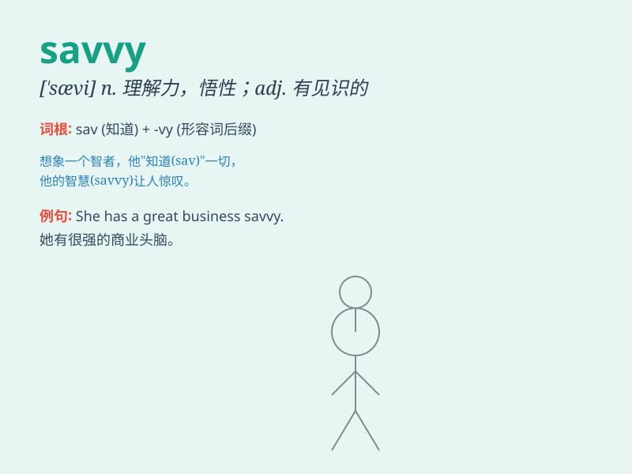

## savvy

**英音:** _[\'sævɪ]_ **美音:** _[\'sævi]_

**译义:** *v.知道,了解n.机智,头脑,理解,悟性*

### 短语

+ **business savvy:** _商业头脑_

+ **fashion savvy:** _时尚触觉_

+ **tech savvy:** _精通技术_

+ **street savvy:** _街头智慧_

+ **media savvy:** _媒体素养_

### 例句

#### 例句1

> **She has a lot of business savvy and always makes smart
decisions.**

**中文翻译:** 她有很强的商业头脑，总是做出明智的决定。

**单词释义:** 实际知识；见识；头脑

#### 例句2

> **You need to be politically savvy to succeed in this job.**

**中文翻译:** 要在这份工作中取得成功，你需要有政治头脑。

**单词释义:** 精明；有见识

#### 例句3

> **He\'s tech-savvy and can fix any computer problem easily.**

**中文翻译:** 他精通技术，能轻松解决任何电脑问题。

**单词释义:** 精通的；在行的

### 背诵小故事

> One day, Tom was lost in a strange city. But he had the savvy to ask
for directions and use a map to find his way back. He knew how to handle
the situation smartly.

**一天，汤姆在一个陌生的城市迷路了。但他很有见识，懂得问路并使用地图找到回去的路。他知道如何聪明地处理这种情况。**

### 图义

